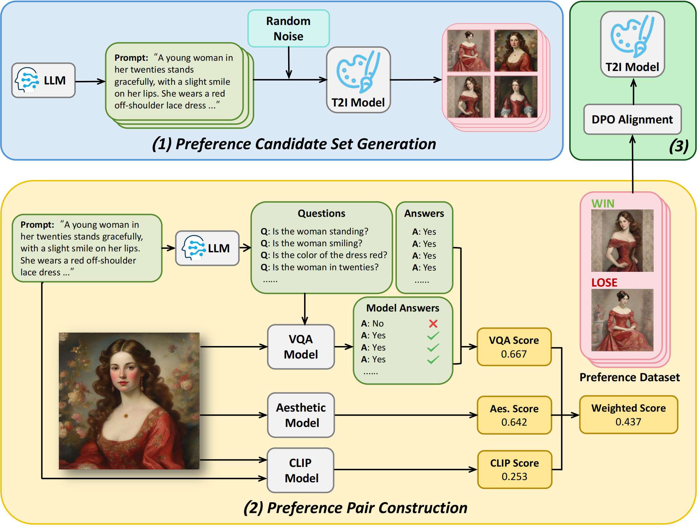
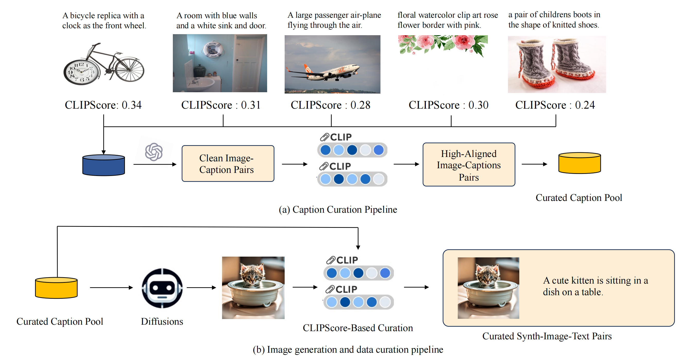
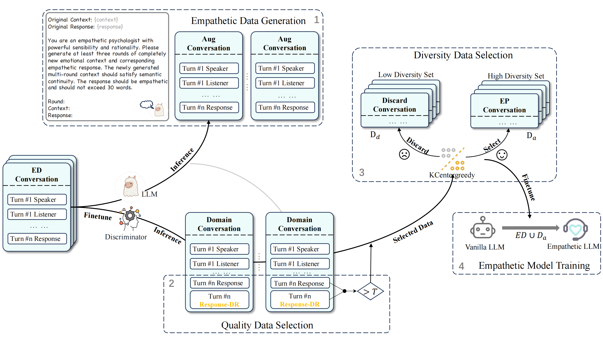
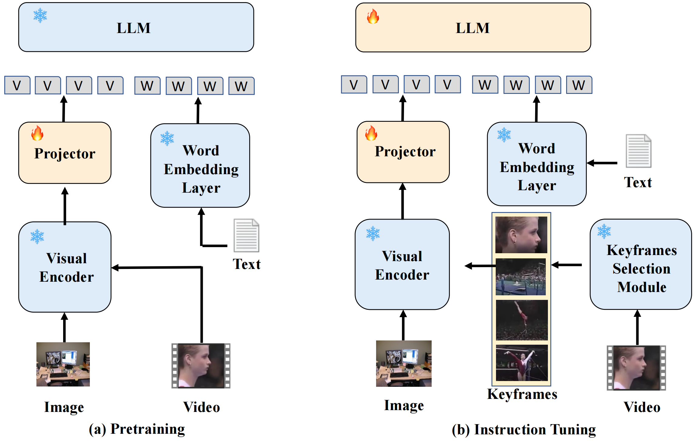








He has been studying at Beihang University since 2022, working towards his Bachelor's Degree. Currently a sophomore, he ranks in the top 5% of his grade. He has already secured a guaranteed place for further studies and is keen on pursuing a Master's Degree or a direct PhD starting in September 2026(26 Fall).

His research interests also include Multimodal, Aligment, Safety,Data-centric AI.He has published many papers at the top international AI conferences with total .

His strengths lie in his excellent mindset, ample self-motivation, passion for research, and strong planning abilities.

He is presently involved in academic collaborations with institutions such as [Princeton](https://www.princeton.edu/), [UC Berkeley](https://www.berkeley.edu/), [SBU](https://www.stonybrook.edu/), [THU](https://www.tsinghua.edu.cn/en/), [PKU](https://www.pku.edu.cn/), [NUS](https://nus.edu.sg/), and [HKU](https://www.hku.hk/). If you are interested in joining the project or exploring collaboration opportunities, please reach out to him via email at jeix782@gmail.com.

<!-- [Shanghai-AI-Laboratory](https://www.shlab.org.cn/), and [Huawei](https://www.huawei.com/en/) -->

# 🔥 News
- *2024.08*: &nbsp;🎉🎉 [Synth-Empathy](https://arxiv.org/pdf/2407.21669) github repo released .
- *2024.08*: &nbsp;🎉🎉 [SynthVLM](https://arxiv.org/pdf/2407.20756) github repo released .
- *2024.06*: &nbsp;🎉🎉 [O2M_attack](https://arxiv.org/abs/2405.20775) dataset 3MAD-Tiny-1K released  3MAD-66K released 
- *2024.06*: &nbsp;🎉🎉 [O2M_attack](https://arxiv.org/abs/2405.20775) github repo released .

# 📝 Publications 

arxiv release

[AGFSync: Leveraging AI Feedback for Preference Optimization in Text-to-Image Generation](https://arxiv.org/pdf/2403.13352)

[Jingkun An](https://scholar.google.com/citations?hl=zh-CN&user=gtoavQoAAAAJ), [Yinghao Zhu](https://scholar.google.com/citations?user=LYrsSoEAAAAJ&hl=zh-CN), Zongjian Li, Haoran Feng, **Xijie Huang**, Bohua Chen, Yemin Shi, [Chengwei Pan](https://scholar.google.com/citations?user=7i1dqbEAAAAJ&hl=en)

arxiv release

[SynthVLM: High-Efficiency and High-Quality Synthetic Data for Vision Language Models](https://arxiv.org/pdf/2407.20756)

Zheng Liu, Hao Liang, **Xijie Huang**, Wentao Xiong, Qinhan Yu, Linzhuang Sun, Chong Chen, Conghui He, [Bin Cui](https://scholar.google.com/citations?user=IJAU8KoAAAAJ&hl=zh-CN), [Wentao Zhang](https://scholar.google.com/citations?user=JE4VON0AAAAJ&hl=zh-CN)

arxiv release

[Synth-Empathy: Towards High-Quality Synthetic Empathy Data](https://arxiv.org/pdf/2407.21669)

Hao Liang, Linzhuang Sun, Jingxuan Wei, **Xijie Huang**, Linkun Sun, Bihui Yu, Conghui He, [Wentao Zhang](https://scholar.google.com/citations?user=JE4VON0AAAAJ&hl=zh-CN)

arxiv release

[KeyVideoLLM: Towards Large-scale Video Keyframe Selection](https://arxiv.org/pdf/2407.03104)

Hao Liang, Jiapeng Li, Tianyi Bai, **Xijie Huang**, Chong Chen, Conghui He, [Bin Cui](https://scholar.google.com/citations?user=IJAU8KoAAAAJ&hl=zh-CN), [Wentao Zhang](https://scholar.google.com/citations?user=JE4VON0AAAAJ&hl=zh-CN)

arxiv release

[Cross-Modality Jailbreak and Mismatched Attacks on Medical Multimodal Large Language Models](https://arxiv.org/pdf/2405.20775)

**Xijie Huang**, [Xinyuan Wang](https://scholar.google.com/citations?hl=en&user=jQSagnIAAAAJ), Hantao Zhang, Jiawen Xi, Jingkun An, Hao Wang, [Chengwei Pan](https://scholar.google.com/citations?user=7i1dqbEAAAAJ&hl=en)

# 🏆 Honors and Awards

- *2024.5* Second place (2/188) in Beihang Fencing League
- *2024.4* 1st Prize (1/50) in Beihang Robotics Competition
- *2023.12* 2nd Prize in the National Mathematics Competition for University Students
- *2023.11* 3rd Prize in the National University Physics Competition for University Students
- *2023.10* Beihang 2nd Class Academic Excellence Scholarship (Top 5% of 1,400 students in the information major category)
- *2023.5* 2nd Prize (24/1304) of Feng Ru Cup (A reinforcement learning based motion state monitoring system)
- *2023.5* 2023 National Student Innovation and Entrepreneurship Training Programme Projects Passed with Merit in the Initial Audit
- *2023.3* 3rd Prize (15/200+) of Beihang Modelling Competition

# 👔 Appointment

- *2024.3* Appointed as a tutor and crosstalk instructor for data structure at Shie College, Beihang University
- *2023.9* Served as Vice President of Academic Support for the Class of 2022 Student Senate
- *2023.9* Appointed as a tutor and crosstalk instructor for physical science, mathematical analysis, computer programming, and linear algebra at Shie College, Beihang University
- *2023.9* Head of the Special Research and Development Department of the Association for Automatic-Control
- *2023.8* Appointed as a mentor for linear algebra at Shie College, Beihang University

# 📖 Educations
- *2022.09 - present*, B.Eng.In [Institute of Automation Science and Electrical Engineering](https://dept3.buaa.edu.cn/), Beihang University, Beijing, China
<!-- - *Fall 2023*, Design and Analysis of Algorithms, Teaching Assistant, Beihang University -->

# 💬 Invited Talks
<!-- - *2024.1*, Basic Modelling 2023 Academic Conference,Multi-modal large language models (MLLMs) sub-field.  -->

# 💻 Internships
<!-- - *2024.07 - present*, [Princeton](https://www.princeton.edu/),USA. He was an online intern undergraduate in Assistant Professor [Kaifeng Lyu](https://kaifeng.ac/)'s group, focusing on research related to alignment in RLHF technology and superalignment.
- *2024.07 - present*, [SBU](https://www.stonybrook.edu/),USA. He was an online intern undergraduate in Assistant Professor [Chenyu You](http://chenyuyou.me/)'s group, focusing on research related to the intersection of medical imaging and AI. -->
- *2024.4 - present*, [Peking University](https://www.pku.edu.cn/),Beijing，China. He was an undergraduate intern in the group of Professor [Bin CUI](https://scholar.google.com/citations?user=IJAU8KoAAAAJ&hl=en) and Professor [Wentao Zhang](https://scholar.google.com/citations?user=JE4VON0AAAAJ&hl=en) at Peking University, where he focused on alignment and data-centric AI.
- *2024.1 - 2024.6*, [Tsinghua University](https://www.tsinghua.edu.cn/),[Beihang University](https://www.buaa.edu.cn/),Beijing，China. He was a intern undergraduate in Professor [Minlie Huang](https://coai.cs.tsinghua.edu.cn/hml)'s group at Tsinghua University(supervised by [Chengwei Pan](https://scholar.google.com/citations?user=7i1dqbEAAAAJ&hl=en)), focusing on the safety issues of Multimodal Large Language Models (MLLMs).
- *2023.11-2024.4*, [Huawei](https://www.huawei.com/cn/),Beijing,China.He was an undergraduate intern in the Professor Huawei Rise Intelligence Programme (昇腾众智), supervised by [Si Liu](https://scholar.google.com/citations?hl=en&user=-QtVtNEAAAAJ) in [Institute of Artificial Intelligence](https://iai.buaa.edu.cn/), Beihang University, Beijing, China
- *2024.1-2024.4* [Beihang University](https://www.buaa.edu.cn/),Beijing, China.Modular Control Design for Miniature Omnidirectional Multi-Rotor Blimp: Integration and Validation. (supervised by [Shaoping Wang](https://www.researchgate.net/scientific-contributions/Shaoping-Wang-2136169370) and [Yixin Zhang](https://www.researchgate.net/profile/Yixin-Zhang-16)) in [Institute of Automation Science and Electrical Engineering](https://dept3.buaa.edu.cn/).
- *2023.7-2024.3* [Beihang University](https://www.buaa.edu.cn/),Beijing, China.Defect detection on workpiece surfaces based on computer vision. (supervised by [Mengqi Ji](https://scholar.google.com/citations?user=tHXXQ1EAAAAJ&hl=zh-CN)) in [Institute of Artificial Intelligence](https://iai.buaa.edu.cn/).

# 🌍 Website Visiting Map

