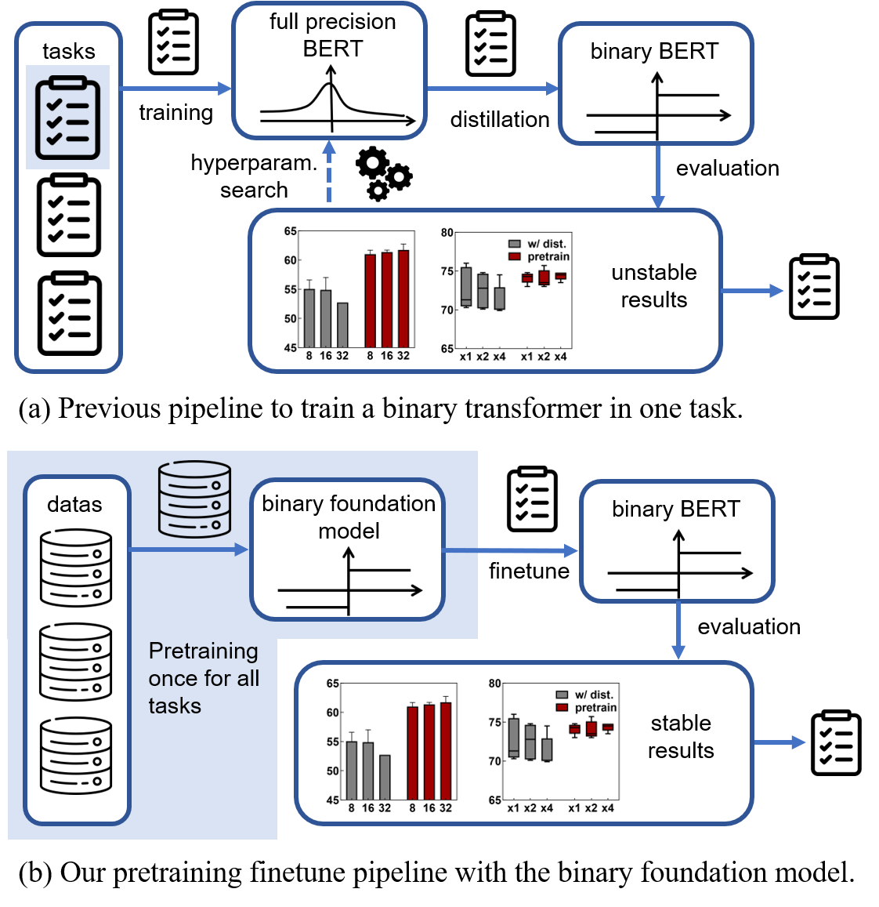
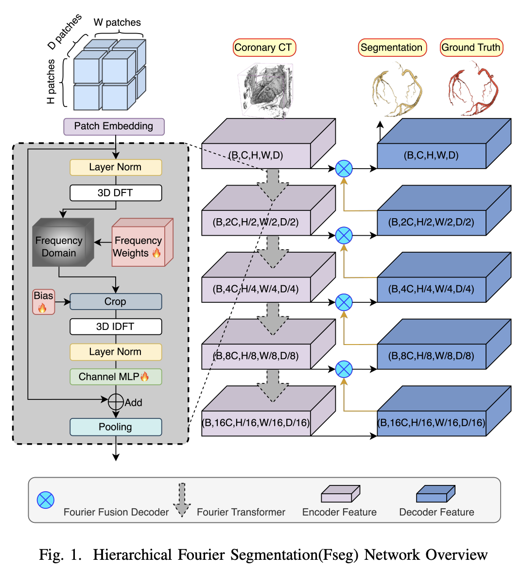








He entered Beihang University in 2022 to pursue his undergraduate bachelor's degree, and is currently a sophomore

His research interests also include machine learning, computer vision, large-scale language modelling, automation and cluster intelligence (currently in an exploratory phase)

<!-- His research interest also includes computer vision and large language model. He has published many papers at the top international AI conferences with total . -->

If you are interested in joining the project or collaborating, please send me an email (jeix782@gmail.com).

# 🔥 News
- *2024.01*: &nbsp;🎉🎉 [BiPFT(accepted by AAAI 2024) was reported by BAAI](https://mp.weixin.qq.com/s/ibBaWCdDcF2pA-Ug9XH1gQ). 
- *2023.12*: &nbsp;🎉🎉 [BiPFT was accepted by AAAI 2024](https://arxiv.org/pdf/2312.08937.pdf).
- *2023.10*: &nbsp;🎉🎉 [Fseg was accepted by BIBM 2023](https://mp.weixin.qq.com/s/ibBaWCdDcF2pA-Ug9XH1gQ). 

# 📝 Publications 

AAAI 2024

[BiPFT:  Binary Pre-trained Foundation Transformer with Low-rank Estimation of
Binarization Residual Polynomials](https://arxiv.org/pdf/2312.08937.pdf)

Xingrun Xing, Li Du, **Xinyuan Wang**, Xianlin Zeng,Yequan Wang, Zheng Zhang, Jiajun Zhang

BIBM 2023

[Leveraging Frequency Domain Learning in 3D
Vessel Segmentation](https://arxiv.org/pdf/2401.06224.pdf)

**Xinyuan Wang**, Chengwei Pan, Hongming Dai, Gangming Zhao, Jinpeng Li, Xiao Zhang, Yizhou Yu

<!-- [**Project**](https://scholar.google.com/citations?view_op=view_citation&hl=zh-CN&user=DhtAFkwAAAAJ&citation_for_view=DhtAFkwAAAAJ:ALROH1vI_8AC) <strong></strong>
- Lorem ipsum dolor sit amet, consectetur adipiscing elit. Vivamus ornare aliquet ipsum, ac tempus justo dapibus sit amet. 

- [Lorem ipsum dolor sit amet, consectetur adipiscing elit. Vivamus ornare aliquet ipsum, ac tempus justo dapibus sit amet](https://github.com), A, B, C, **CVPR 2020** -->
# 🎖 scientific research experience
- *2023.7-2024.5* Defect detection on workpiece surfaces based on computer vision. (supervised by [Mengqi Ji](https://scholar.google.com/citations?user=tHXXQ1EAAAAJ&hl=zh-CN)) in [Institute of Artificial Intelligence](https://iai.buaa.edu.cn/), Beihang University, Beijing, China
- *2023.7-2024.3* Huawei Rise Intelligence Programme(昇腾众智). (supervised by [Si Liu](https://sites.google.com/site/siliuhome/home)) in [Institute of Artificial Intelligence](https://iai.buaa.edu.cn/), Beihang University, Beijing, China
- 

# 🎖 Honors and Awards
- *2023.12* Second Prize in the National Mathematics Competition for University Students
- *2023.11* Third Prize in the National University Physics Competition for University Students
- *2023.10* Beihang Second Class Academic Excellence Scholarship
- *2023.5* 2023 National Student Innovation and Entrepreneurship Training Programme Projects Passed with Merit in the Initial Audit
- *2023.3* Third Prize of Beihang Modelling Competition
# 📖 Educations
- *2022.09 - present*, M.Eng. (supervised by [Chengwei Pan](https://scholar.google.com/citations?user=7i1dqbEAAAAJ&hl=en)) in [Institute of Artificial Intelligence](https://iai.buaa.edu.cn/), Beihang University, Beijing, China
- *Fall 2023*, Design and Analysis of Algorithms, Teaching Assistant, Beihang University
- *2018.09 - 2022.06*, B.Eng. (supervised by [Cao Peng](https://scholar.google.com/citations?user=0OfgZSsAAAAJ&hl=zh-CN)) in School of Computer Science and Engineering, Northeastern University, Shenyang, China

<!-- # 💬 Invited Talks
- *2023.12*, Lorem ipsum dolor sit amet, consectetur adipiscing elit. Vivamus ornare aliquet ipsum, ac tempus justo dapibus sit amet. 
- *2021.03*, Lorem ipsum dolor sit amet, consectetur adipiscing elit. Vivamus ornare aliquet ipsum, ac tempus justo dapibus sit amet.  \| [\[video\]](https://github.com/) -->

# 💻 Internships
- *2023.02 - 2023.08*, [BAAI](https://www.baai.ac.cn/), China. He was a research intern in the Cognitive Large-Scale Model Group mentored by [Xin Jiang](https://scholar.google.com/citations?user=3mqJwa8AAAAJ&hl=zh-CN) and [Yequan Wang](https://www.wangyequan.com/).