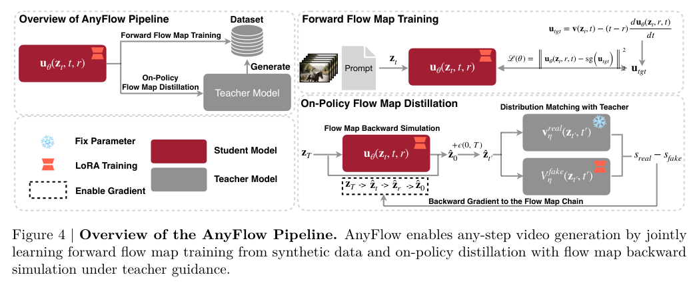
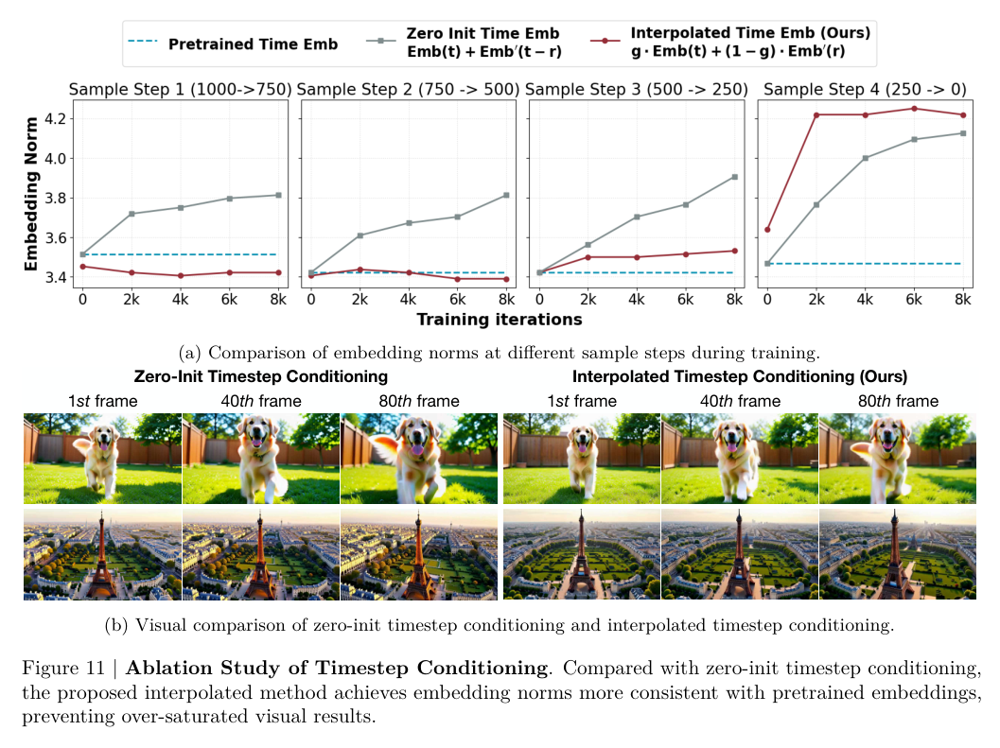

<section class="weekly-paper-page">
  <a class="weekly-back-link" href="/blog/2026/05/11/generative-models-weekly-2026-05-11/">返回周报总览</a>
  
生成模型 · 2026.5.11 - 5.17

  

    A01
    

      <h2>AnyFlow: Any-Step Video Diffusion Model with On-Policy Flow Map Distillation</h2>
      
视频 / 时序生成

    

  

  <section class="weekly-deep-read weekly-story-v2 weekly-story-essay">
        
AnyFlow 的核心价值是让同一个视频 diffusion 模型覆盖不同 step budget，而非只在某个固定采样步数上调到最优。

        

        
视频生成一旦进入产品环境，采样步数就不再是论文里的固定超参。用户预览需要低延迟，最终渲染需要更高质量，批量生成又会把成本压到很低。一个模型如果只能在 4-step 或 8-step 某个点上表现好，部署时就会被迫维护多套模型或接受质量断崖。

AnyFlow 讨论的 any-step video diffusion 就是这个问题：同一个 video diffusion model 在不同 step budget 下都要可用，并且随着步数增加仍能获得稳定收益。这里的核心对象是质量、延迟和成本构成的一条曲线。

这类问题不能只看低步数样例是否漂亮。真正困难的是采样步数变化时，模型访问的中间状态、时间条件和 teacher 监督是否仍然在同一条生成路径上。部署端需要的是一条可调曲线，而非几个离散的最佳点。

consistency distillation 的风险在于削弱 ODE sampling 原有的 test-time scaling：student 少步可用，并不等于多给几步还能稳定变好；一旦轨迹错位，多步只剩接口自由，不能带来质量弹性。

因此 AnyFlow 把问题收束到 trajectory mismatch。teacher 的知识来自 probability-flow ODE，student 推理访问的是自己的 consistency sampling trajectory。方法的目标，是让这两条路径重新对齐。

这里的关键重点是承认 student 推理时的状态分布已经变了。只要训练仍停留在 teacher 的离线 ODE 轨迹上，student 多走几步时就会不断进入监督没有覆盖的区域。

传统 consistency distillation 的 teacher 通常沿 probability-flow ODE 轨迹提供监督，但 student 推理时走的是 consistency sampling trajectory。两条路径在训练目标里被近似成同一件事，实际部署时却会访问不同状态。

这个错位在少步生成时可能不明显，因为模型只被要求快速落到一个可接受样本；一旦增加采样步数，student 会不断访问自己生成的中间状态，teacher 的离线 ODE 轨迹监督就不再覆盖这些状态。AnyFlow 的出发点是把这个训练-推理错位显式补上。

AnyFlow 的关键转折是 on-policy flow map distillation。teacher 的 probability-flow ODE 仍然提供方向，但监督位置改为 student 自己会访问的 flow map。换句话说，训练不再只问“teacher 在这个点会怎么走”，还问“student 实际走到这里之后，应该如何被拉回正确流场”。

Figure 4 可以把这件事看清楚：forward flow map training 先让模型学习从噪声到数据的平均速度映射，on-policy distillation 再通过 backward simulation 把 student 自己的采样链纳入监督。teacher 仍然提供方向，但监督位置来自 student 的实际轨迹。
<figure class="weekly-inline-figure weekly-inline-figure--float">

<figcaption>Figure 4 p.7</figcaption>
</figure>
这个设计的价值在于，它把 step elasticity 绑定到 flow map 本身。模型学习的是在不同时间间隔、不同中间状态下如何保持同一条生成路径的语义连续性，而非一个固定 NFE 的捷径。

把它放到更大的 diffusion/flow 语境里看，AnyFlow 的贡献重点是把“步数”变成训练时显式建模的变量。student 学到的重点是一组在不同时间跨度上仍然自洽的状态转移。

训练流程里还有一个容易被忽略的细节：interpolated timestep conditioning。any-step 模型需要处理额外的时间组合，如果直接新增 timestep embedding，模型会遇到冷启动和分布外表征问题。AnyFlow 的做法是用已有 pretrained timestep embedding 做插值，让新条件仍落在模型熟悉的 embedding 几何里。

推理时，用户可以选择不同采样步数；模型通过同一套 flow map 在这些步数之间移动。这里的“可调”来自训练阶段已经覆盖的不同步长状态转换，不是临时删掉一些 denoising step。

这也是 Figure 11 值得看的原因：timestep embedding 的 norm 如果偏离预训练区域，模型会把时间条件理解成陌生输入，生成质量容易变成过饱和或不稳定。插值重点是在保护原模型已经学到的时间表征几何。

实验最值得看的是 step elasticity 是否成立：少步时不能崩，多步时要能继续吃到 teacher 轨迹知识，且质量提升不能靠牺牲稳定性换来。

Figure 11 对 interpolated timestep conditioning 给了一个很直接的消融。zero-init timestep conditioning 的 embedding norm 偏离 pretrained baseline，容易带来过饱和视觉结果；插值条件让 embedding norm 更贴近预训练区间，说明这个小设计在保护原模型表征几何。
<figure class="weekly-inline-figure weekly-inline-figure--wide">

<figcaption>Figure 11 p.15</figcaption>
</figure>
因此结果应读成两层：on-policy flow map distillation 解决 trajectory mismatch，interpolated timestep conditioning 解决额外时间条件的表征偏移。一个管轨迹，一个管条件表征，二者一起支撑 any-step 的稳定性。

如果只看最终样例，很容易把这篇读成又一个 video distillation 方法。更准确的读法是：它在证明 any-step 的瓶颈重点是训练轨迹、推理轨迹和时间条件三者能否同时对齐。

这篇的领域价值在于把视频生成的评价对象从“固定步数的最好样例”推到“同一模型下的质量-延迟曲线”。这更接近真实部署：实时预览、交互编辑、最终渲染本来就共享一个底座模型，却需要不同成本点。

如果这条路线成立，未来视频模型的竞争会多一个维度：不仅看最优画质，也看 step budget 改变时质量是否平滑、成本是否可控、同一模型能否跨场景复用。

对后续工作来说，AnyFlow 给出的坐标很清楚：不要只汇报一个 NFE 下的最佳 FVD 或视觉样例，而要汇报整条 quality-latency curve，以及不同控制条件下这条曲线是否仍然平滑。

接下来真正要看的，是 step elasticity 能否在更长视频、更复杂运动和更强控制条件下成立，并形成统一评测，而非各自挑选最有利的采样步数。

        

        </section>
  
  
arXiv 链接<a href="https://arxiv.org/abs/2605.13724" rel="noopener">https://arxiv.org/abs/2605.13724</a>

</section>
