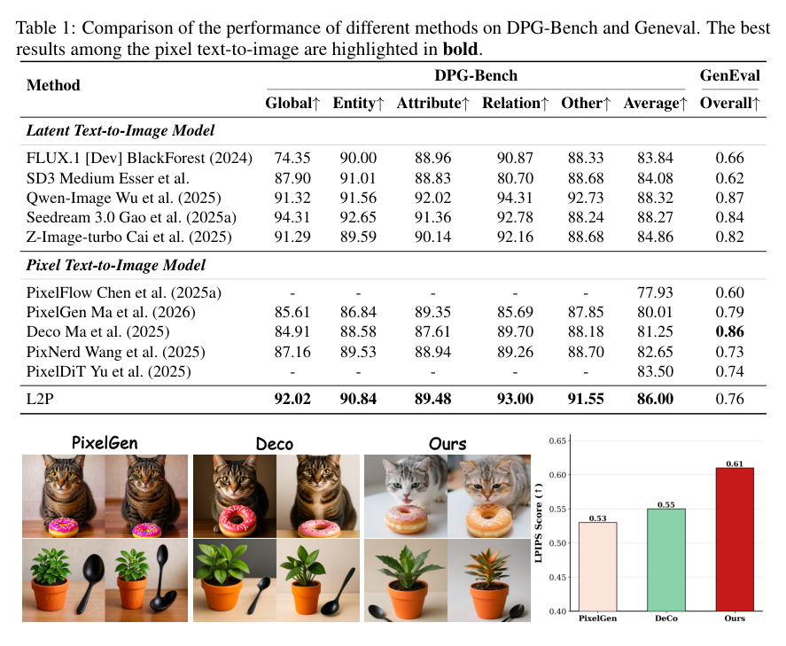
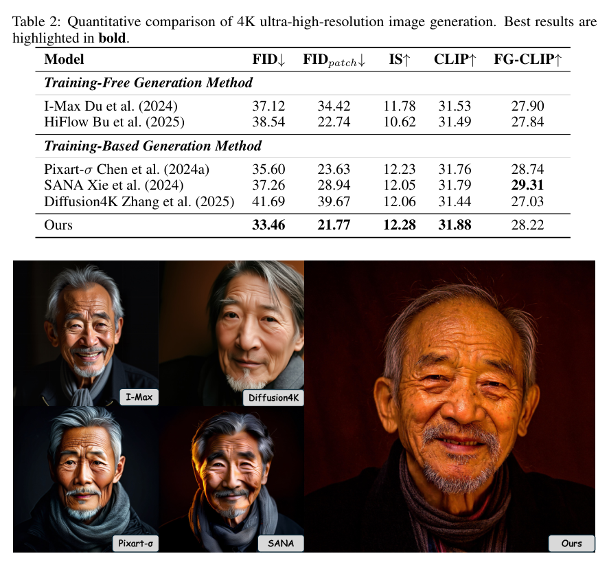

<section class="weekly-paper-page">
  <a class="weekly-back-link" href="/blog/en/2026/05/11/generative-models-weekly-2026-05-11/">Back to weekly overview</a>
  
Generative Models · May 11 - May 17, 2026

  

    A10
    

      <h2>L2P: Unlocking Latent Potential for Pixel Generation</h2>
      
Image / visual synthesis

    

  

  <section class="weekly-deep-read weekly-story-v2 weekly-story-essay">
        
pixel diffusion 回潮的核心在继承已有 latent 模型能力。路线竞争从 architecture 进入 knowledge transfer。 它让 pixel-space 方法重新进入讨论：更直接的像素建模可能带来细节和可控性，但训练成本需要被转移掉。

        

        
L2P targets a hard constraint in generative modeling: Transfers latent-diffusion knowledge into pixel diffusion to avoid training pixel models from scratch.

The useful lens is latent representation / tokenizer reconstruction / semantic-detail allocation: the paper should be read through the variable it changes inside the generation process, not only through final samples.

The paper asks whether the model can make latent representation / tokenizer reconstruction / semantic-detail allocation a trainable and measurable part of the generation process.

The common failure mode is a mismatch between training assumptions, inference state, and evaluation target; the output may look plausible while the system remains hard to reuse.

The method can be compressed as: Latent-to-Pixel transfer using pretrained LDMs to build pixel-space models.

The concrete method clue is: Generating our training corpus directly from the source LDM forces the new pixel-space model to fit the smooth data manifold already constructed by the source model, significantly accelerating convergence and activating its intrinsic prior knowledge.

The reusable part is the middle of the pipeline: how conditions, latent states, or sampling paths are constrained before the final output is rendered.

The reported effect is: With the VAE removed and minimal training overhead, L2P reports 86.00 on DPG-Bench. The point is that pixel diffusion can inherit latent-model capability instead of being trained from scratch.
<figure class="weekly-inline-figure weekly-inline-figure--wide">

<figcaption>Table 1 p.6</figcaption>
</figure><figure class="weekly-inline-figure weekly-inline-figure--wide">

<figcaption>Table 2 p.8</figcaption>
</figure>
The traceable result clue is: Notably, despite discarding the V AE and requiring minimal training overhead, L2P achieves a score of 86.00 on DPG-Bench.

The return of pixel diffusion depends on inheriting latent-model capability, not brute-force training. It affects how image generation trades off quality, cost, and controllability.

The next check is whether the mechanism remains stable across data, scale, resolution, and tighter control conditions.

        

        </section>
  
  
arXiv<a href="https://arxiv.org/abs/2605.12013" rel="noopener">https://arxiv.org/abs/2605.12013</a>

</section>
