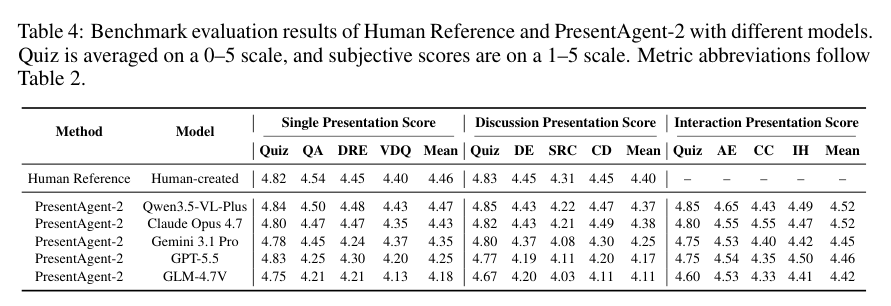
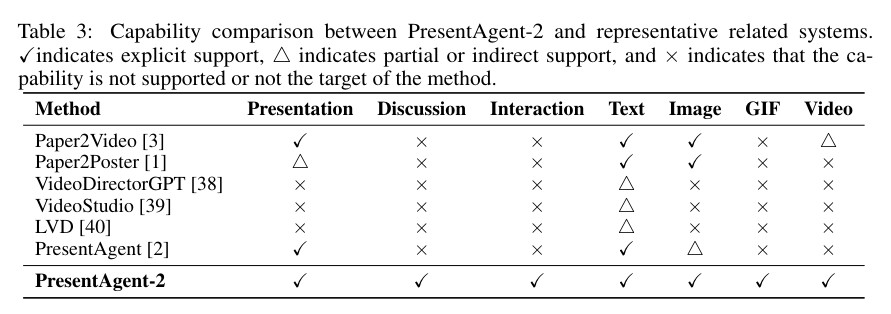

<section class="weekly-paper-page">
  <a class="weekly-back-link" href="/blog/en/2026/05/11/generative-models-weekly-2026-05-11/">Back to weekly overview</a>
  
Generative Models · May 11 - May 17, 2026

  

    A11
    

      <h2>PresentAgent-2: Towards Generalist Multimodal Presentation Agents</h2>
      
Video / temporal generation

    

  

  <section class="weekly-deep-read weekly-story-v2 weekly-story-essay">
        
这篇更像系统信号：生成模型的价值从单个 media output 进入复合内容生产链路。 它提示生成模型的落地形态会越来越像 production stack：模型能力、检索、规划、编辑和交付界面必须一起设计。

        

        
PresentAgent-2 targets a hard constraint in generative modeling: Moves presentation generation from static slides to research-grounded multimedia presentation videos.

The useful lens is temporal state / history cache / rollout stability: the paper should be read through the variable it changes inside the generation process, not only through final samples.

The paper asks whether the model can make temporal state / history cache / rollout stability a trainable and measurable part of the generation process.

The common failure mode is a mismatch between training assumptions, inference state, and evaluation target; the output may look plausible while the system remains hard to reuse.

The method can be compressed as: Agentic pipeline for topic framing, research, media assembly, and video delivery.

The concrete method clue is: To relax this requirement, we introduce PresentAgent-2, a multimodal agent that generates presentation videos from user queries.

The reusable part is the middle of the pipeline: how conditions, latent states, or sampling paths are constrained before the final output is rendered.

The reported effect is: The benchmark shows coverage across presentation, discussion, interaction, and text/image/GIF/video modules. The result is content-pipeline coverage, not a single model metric.
<figure class="weekly-inline-figure weekly-inline-figure--wide">

<figcaption>Table 4 p.8</figcaption>
</figure><figure class="weekly-inline-figure weekly-inline-figure--wide">

<figcaption>Table 3 p.8</figcaption>
</figure>
The traceable result clue is: Method Presentation Discussion Interaction Text Image GIF Video Paper2Video [3]✓× ×✓ ✓× △ Paper2Poster [1]△ × ×✓ ✓× × VideoDirectorGPT [38]× × × △ × × × VideoStudio [39]× × × △ × × × LVD [40]× × × △ × × × PresentAgent [2]✓× ×✓△ × × PresentAgent-2✓ ✓ ✓ ✓ ✓ ✓ ✓ Table 4: Benchmark evaluation results of.

Generative models are entering compound content systems beyond single images or clips. It points to end-to-end content production as a major value path.

The next check is whether the mechanism remains stable across data, scale, resolution, and tighter control conditions.

        

        </section>
  
  
arXiv<a href="https://arxiv.org/abs/2605.11363" rel="noopener">https://arxiv.org/abs/2605.11363</a>

</section>
