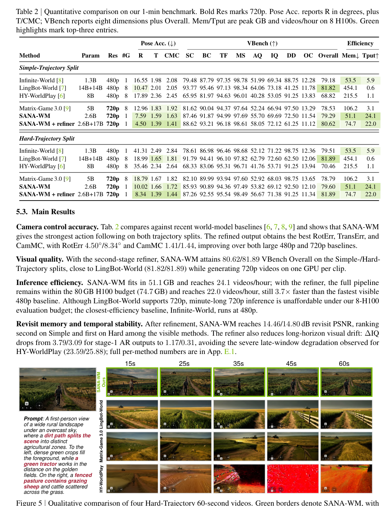
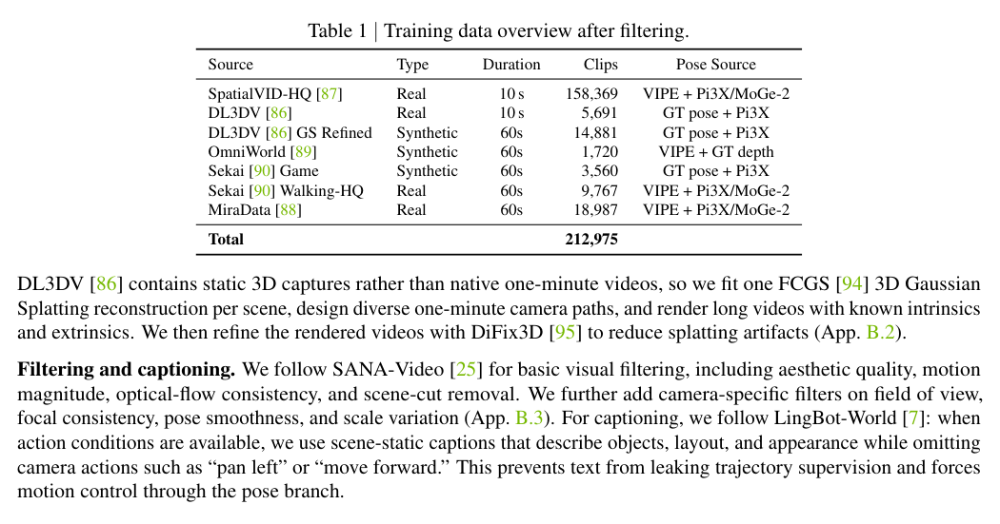

<section class="weekly-paper-page">
  <a class="weekly-back-link" href="/blog/en/2026/05/11/generative-models-weekly-2026-05-11/">Back to weekly overview</a>
  
Generative Models · May 11 - May 17, 2026

  

    A12
    

      <h2>SANA-WM: Efficient Minute-Scale World Modeling with Hybrid Linear Diffusion Transformer</h2>
      
Video / temporal generation

    

  

  <section class="weekly-deep-read weekly-story-v2 weekly-story-essay">
        
视频 world model 的竞争坐标变清楚了：duration、openness、efficiency、camera control。大模型样片之外，开源可复现很关键。 分钟级生成把时间一致性问题放大，也把成本问题放大；这类模型决定 world model 能否进入研究和产品原型。

        

        
SANA-WM targets a hard constraint in generative modeling: Introduces a 2.6B open-source world model for minute-scale 720p video with camera control.

The useful lens is temporal state / history cache / rollout stability: the paper should be read through the variable it changes inside the generation process, not only through final samples.

The paper asks whether the model can make temporal state / history cache / rollout stability a trainable and measurable part of the generation process.

The common failure mode is a mismatch between training assumptions, inference state, and evaluation target; the output may look plausible while the system remains hard to reuse.

The method can be compressed as: Hybrid linear diffusion transformer for long-duration, efficient world modeling.

The concrete method clue is: GDN + softmax LTX2 / 720p 0.7834 0.9226 0.8530 5.68 433.2 2.31 GDN key scaling.We evaluate training stability under identical conditions: 81-frame sequences and an all-GDN [ 11] architecture initialized from a shared LTX2-V AE [10] cumulative-linear checkpoint.

The reusable part is the middle of the pipeline: how conditions, latent states, or sampling paths are constrained before the final output is rendered.

The reported effect is: The paper reports minute-scale generation in a single-GPU setting: bidirectional / chunk-causal variants fit in one H100, and the distilled variant generates one minute in 34s on an RTX 5090 with NVFP4. The effect is a lower cost floor for long-video world models.
<figure class="weekly-inline-figure weekly-inline-figure--wide">

<figcaption>Table 2 p.8</figcaption>
</figure><figure class="weekly-inline-figure weekly-inline-figure--wide">

<figcaption>Table 1 p.7</figcaption>
</figure>
The traceable result clue is: Most importantly for accessibility, it reduces minute-scale generation to a single-GPU inference setting: the bidirectional and chunk-causal variants fit within one H100, and our distilled variant brings 1-minute video generation to 34s on a single RTX 5090 with NVFP4 quantization.

Video world models are being judged by duration, openness, efficiency, and camera control. It moves long-video generation toward deployable world-model infrastructure.

The next check is whether the mechanism remains stable across data, scale, resolution, and tighter control conditions.

        

        </section>
  
  
arXiv<a href="https://arxiv.org/abs/2605.15178" rel="noopener">https://arxiv.org/abs/2605.15178</a>

</section>
