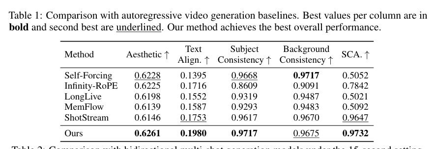
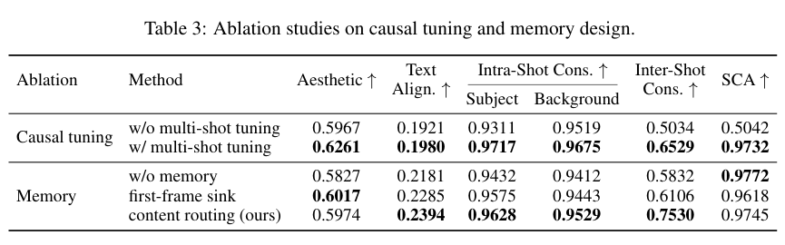

<section class="weekly-paper-page">
  <a class="weekly-back-link" href="/blog/en/2026/05/11/generative-models-weekly-2026-05-11/">Back to weekly overview</a>
  
Generative Models · May 11 - May 17, 2026

  

    A13
    

      <h2>CausalCine: Real-Time Autoregressive Generation for Multi-Shot Video Narratives</h2>
      
Video / temporal generation

    

  

  <section class="weekly-deep-read weekly-story-v2 weekly-story-essay">
        
长视频的核心约束是剪辑语法：镜头要换，语义要走，节奏要持续。单纯 rollout 会带来运动停滞和语义漂移。 这篇和 RAVEN / Causal Forcing++ 放在一起看，能看到实时视频生成正在拆成三件事：低延迟、长程记忆、叙事状态。

        

        
CausalCine targets a hard constraint in generative modeling: Targets real-time autoregressive generation for multi-shot video narratives.

The useful lens is geometry constraints / correspondence / cross-view consistency: the paper should be read through the variable it changes inside the generation process, not only through final samples.

The paper asks whether the model can make geometry constraints / correspondence / cross-view consistency a trainable and measurable part of the generation process.

The common failure mode is a mismatch between training assumptions, inference state, and evaluation target; the output may look plausible while the system remains hard to reuse.

The method can be compressed as: Explicitly handles event progression, viewpoint changes, and shot boundaries.

The concrete method clue is: 3.3); and (iii) distill the resulting full-step causal model into a four-step generator for interactive synthesis (Sec.

The reusable part is the middle of the pipeline: how conditions, latent states, or sampling paths are constrained before the final output is rendered.

The reported effect is: The system builds on a 14B video generator and runs streaming KV caching on 8 NVIDIA H200 GPUs at 16 FPS. The effect is a real-time autoregressive interface for multi-shot narrative.
<figure class="weekly-inline-figure weekly-inline-figure--wide">

<figcaption>Table 1 p.8</figcaption>
</figure><figure class="weekly-inline-figure weekly-inline-figure--wide">

<figcaption>Table 3 p.8</figcaption>
</figure>
The traceable result clue is: We build CausalCine on a 14B-parameter video generator and run it with streaming KV caching on 8 NVIDIA H200 GPUs at 16 FPS.

Long video generation is about shot and narrative structure, not duration alone. This is closer to real film and advertising production.

The next check is whether the mechanism remains stable across data, scale, resolution, and tighter control conditions.

        

        </section>
  
  
arXiv<a href="https://arxiv.org/abs/2605.12496" rel="noopener">https://arxiv.org/abs/2605.12496</a>

</section>
