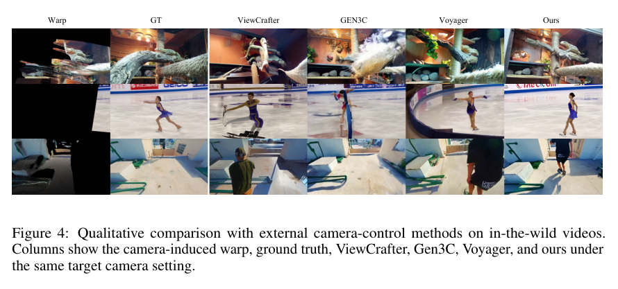
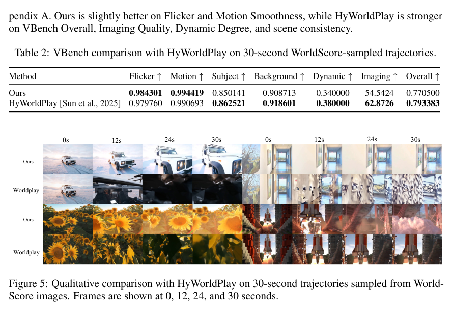

<section class="weekly-paper-page">
  <a class="weekly-back-link" href="/blog/en/2026/05/11/generative-models-weekly-2026-05-11/">Back to weekly overview</a>
  
Generative Models · May 11 - May 17, 2026

  

    A14
    

      <h2>Warp-as-History: Generalizable Camera-Controlled Video Generation from One Training Video</h2>
      
Video / temporal generation

    

  

  <section class="weekly-deep-read weekly-story-v2 weekly-story-essay">
        
相机控制的难点在时序几何；history 本身可以成为控制接口，减少对重控制分支的依赖。 叙事视频、广告、虚拟场景都需要可控镜头语言；这类方法把 camera control 变成更轻的训练问题。

        

        
Warp-as-History targets a hard constraint in generative modeling: Uses history warping for camera-controlled video generation with less dependence on annotated camera videos.

The useful lens is temporal state / history cache / rollout stability: the paper should be read through the variable it changes inside the generation process, not only through final samples.

The paper asks whether the model can make temporal state / history cache / rollout stability a trainable and measurable part of the generation process.

The common failure mode is a mismatch between training assumptions, inference state, and evaluation target; the output may look plausible while the system remains hard to reuse.

The method can be compressed as: Training-free or low-training camera control by using warped history as condition.

The concrete method clue is: The final model uses offline LoRA finetuning on one separate camera-annotated video to stabilize this behavior and improve quality, foreground dynamics, and disocclusion.

The reusable part is the middle of the pipeline: how conditions, latent states, or sampling paths are constrained before the final output is rendered.

The reported effect is: One-shot finetuning raises subjective quality from 47.37 to 54.83 and average score from 63.26 to 65.64. The concrete result: warped history is a lightweight but useful camera-control interface.
<figure class="weekly-inline-figure weekly-inline-figure--wide">

<figcaption>Figure 4 p.7</figcaption>
</figure><figure class="weekly-inline-figure weekly-inline-figure--wide">

<figcaption>Figure 5 p.8</figcaption>
</figure>
The traceable result clue is: One-shot finetuning mainly improves visual quality over the zero-shot interface: Subjective Quality increases from 47.37 to 54.83, a 15.7% relative gain, while the average score also improves from 63.26 to 65.64.

Video control does not only require heavier control branches; temporal conditioning design matters. Camera control is a key interface for narrative, advertising, and 3D scene reuse.

The next check is whether the mechanism remains stable across data, scale, resolution, and tighter control conditions.

        

        </section>
  
  
arXiv<a href="https://arxiv.org/abs/2605.15182" rel="noopener">https://arxiv.org/abs/2605.15182</a>

</section>
