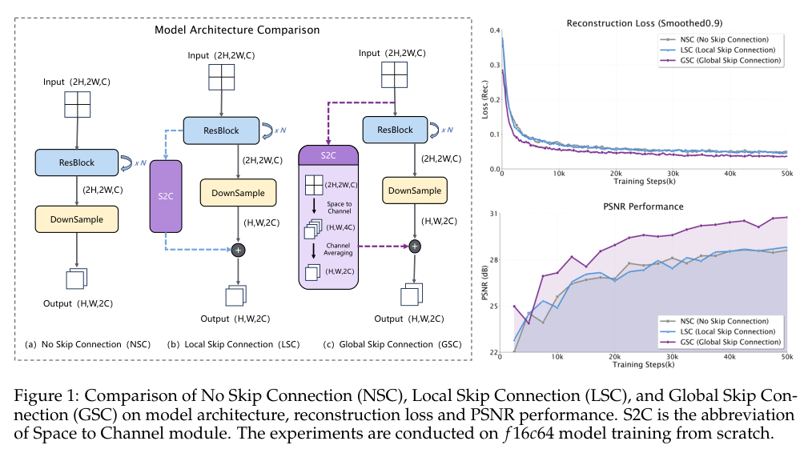
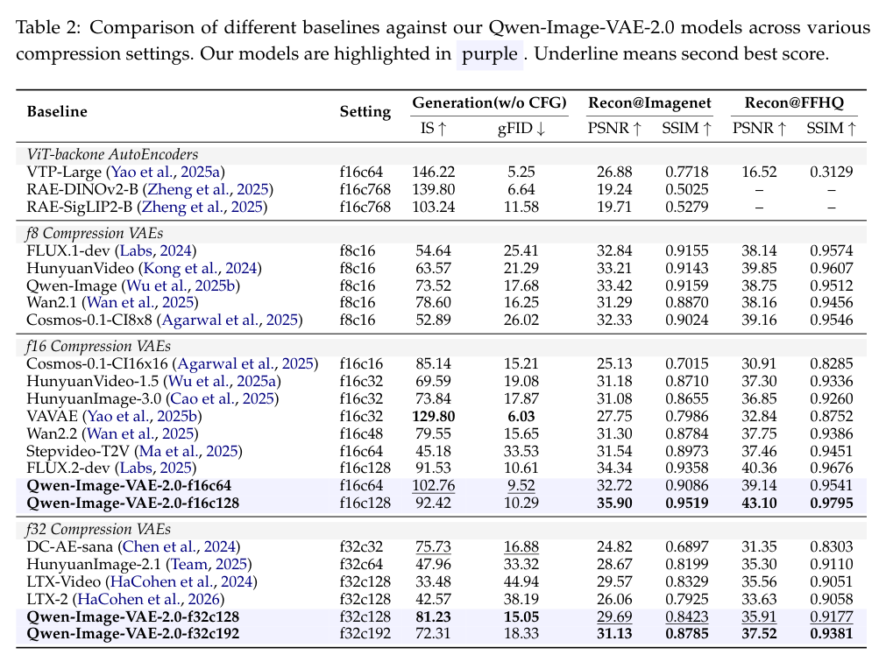

<section class="weekly-paper-page">
  <a class="weekly-back-link" href="/blog/en/2026/05/11/generative-models-weekly-2026-05-11/">Back to weekly overview</a>
  
Generative Models · May 11 - May 17, 2026

  

    A15
    

      <h2>Qwen-Image-VAE-2.0 Technical Report</h2>
      
Image / visual synthesis

    

  

  <section class="weekly-deep-read weekly-story-v2 weekly-story-essay">
        
这篇说明基础图像模型的上限一部分卡在 codec。denoiser 再强，latent 表征丢掉的文字和细节也很难补回。 多语言文字、海报、UI、设计稿都依赖 VAE 质量；这是生成模型进入设计工作流的底层门槛。

        

        
Qwen-Image-VAE-2.0 Technical Report targets a hard constraint in generative modeling: Upgrades the VAE compression layer for reconstruction quality and diffusability.

The useful lens is latent representation / tokenizer reconstruction / semantic-detail allocation: the paper should be read through the variable it changes inside the generation process, not only through final samples.

The paper asks whether the model can make latent representation / tokenizer reconstruction / semantic-detail allocation a trainable and measurable part of the generation process.

The common failure mode is a mismatch between training assumptions, inference state, and evaluation target; the output may look plausible while the system remains hard to reuse.

The method can be compressed as: High-compression VAE with Global Skip Connections and expanded latent channels.

The concrete method clue is: In this work, we introduce Qwen-Image-VAE-2.0, a series of high-compression image VAEs (f 16 &amp; f 32), designed to overcome these challenges through improved architecture, comprehensive data engineering, and enhanced training strategy.

The reusable part is the middle of the pipeline: how conditions, latent states, or sampling paths are constrained before the final output is rendered.

The reported effect is: Table 2 reports state-of-the-art reconstruction fidelity within the corresponding compression tiers. The read is direct: VAE quality caps text, detail, and high-resolution generation.
<figure class="weekly-inline-figure weekly-inline-figure--wide">

<figcaption>Figure 1 p.3</figcaption>
</figure><figure class="weekly-inline-figure weekly-inline-figure--wide">

<figcaption>Table 2 p.8</figcaption>
</figure>
The traceable result clue is: As demonstrated in Table 2, Qwen-Image-VAE-2.0 achieves state-of-the-art reconstruction fidelity within its corresponding compression tiers (f 16 and f 32).

The ceiling is not only the denoiser; the latent codec is core infrastructure. VAE quality affects text rendering, detail fidelity, and high-resolution stability.

The next check is whether the mechanism remains stable across data, scale, resolution, and tighter control conditions.

        

        </section>
  
  
arXiv<a href="https://arxiv.org/abs/2605.13565" rel="noopener">https://arxiv.org/abs/2605.13565</a>

</section>
