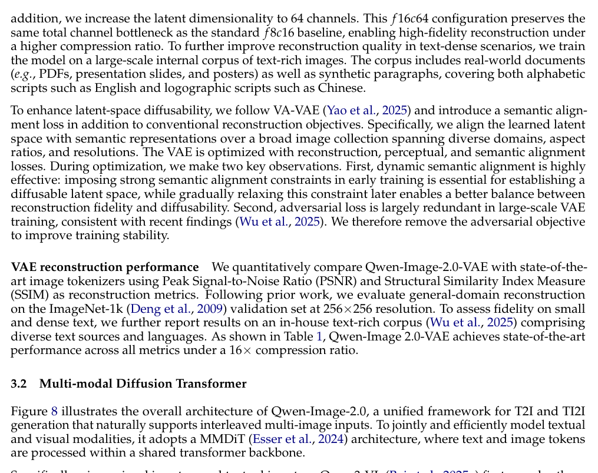
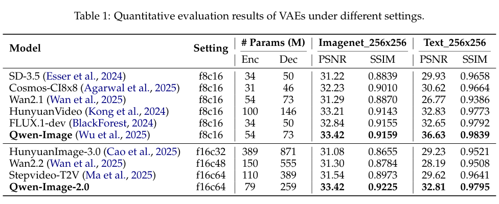

<section class="weekly-paper-page">
  <a class="weekly-back-link" href="/blog/2026/05/11/generative-models-weekly-2026-05-11/">返回周报总览</a>
  
生成模型 · 2026.5.11 - 5.17

  

    A16
    

      <h2>Qwen-Image-2.0 Technical Report</h2>
      
图像 / 视觉合成

    

  

  <section class="weekly-deep-read weekly-story-v2 weekly-story-essay">
        
图像模型的竞争点正在从样张审美进入 production capability：文字、排版、编辑一致性和指令遵循。 设计、营销和内容生产最怕文字错、版式漂、局部编辑破坏整体；这篇对应真实工作流里的高频痛点。

        

        
Qwen-Image-2.0 Technical Report 的切入点很具体：Qwen-Image-2.0 把高保真生成、精准编辑、长文本渲染、多语言排版和部署效率放进同一个图像模型目标。

这类工作关注生成过程里的一个硬约束：路径、表征、控制或评测只要处理不好，最终样例就会失去可复用价值。

论文开头已经把问题形状讲清楚：We presentQwen-Image-2.0, an omni-capable image generation foundation model that unifies high-fidelity image generation and precise image editing within a single integrated framework. While current image generation foundation models excel at highquality aesthetic generation and text rendering, they still face significa。读这类工作，要看方法是否改变生成过程里的真实瓶颈，而不只看样例。

模型能否把这个约束变成可训练、可测量的变量，而非留在工程调参里。

在本周关键词中，它对应 reward signal / benchmark protocol / 评价闭环。这里的关键词指向本文真正改动的位置：模型在哪里少走弯路、少丢信息，或者少依赖人工挑样例。

旧路线常把约束当作附属设置处理，导致训练目标、推理路径和实际评价之间存在缝隙。

这类缺口经常隐藏在系统边界里：训练时条件干净，部署时条件会漂；论文里看的是局部指标，用户面对的是完整生成链路。好的方法必须把这个缝隙显式收进模型或评测。

方法可以先压成一句：以 Qwen3-VL 作为多模态理解底座，统一 generation、editing、text rendering 和高分辨率 photorealism。

方法段可核对的线索是：Model Update Curated Dataset Optimize Prompt Enhancer Reward Policy Adjustment Bad Case MiningUser Feedback Model Training Figure 7: An error-attribution-driven closed-loop data flywheel for multi-track targeted optimization. • Stage 1: Multi-source signal collection.The flywheel begins with a compr。

机制判断要看变量进入计算图的位置，以及它如何改变采样路径、中间表征或输出评价。

因此本文的机制重点是重新安排 reward signal / benchmark protocol / 评价闭环 的责任边界：哪些变量由模型内部学习，哪些变量由训练目标约束，哪些变量在推理时变成可调接口。

按执行链路看，第一步是把输入条件变成模型可用的状态，第二步是在中间表征或采样路径上施加约束，第三步才是输出图像、视频或三维结果。

Qwen-Image-2.0 Technical Report 的可复用部分主要在第二步。只要这个中间约束成立，方法就有机会迁移到更大的模型、更多数据或更复杂的控制条件；如果它只在最后输出端修补，扩展性会弱很多。

机制图和结果表要贴着正文读：它们固定比较对象、指标和消融变量，能帮助判断方法是否真的改到了计算路径或评价协议。

结果部分的硬信号是：benchmark 里 Qwen-Image-2.0 报告全局第 9、中文模型第 1。更重要的效果是能力组合：生成、编辑、长文本渲染、多语言排版被放进同一个图像模型目标。
<figure class="weekly-inline-figure weekly-inline-figure--wide">

<figcaption>Figure 8 p.11</figcaption>
</figure><figure class="weekly-inline-figure weekly-inline-figure--wide">

<figcaption>Table 1 p.11</figcaption>
</figure>
结果部分给出的细节是：As shown in Figure 12, Qwen-Image-2.0 achieves strong performance on this widely recognized image generation benchmark, ranking #9 globally and #1 among Chinese models。

图表给出的定位是：p.11 的 Figure 8：illustrates the overall architecture of Qwen-Image-2.0, a unified framework for T2I and TI2I generation that naturally supports interleaved multi-image inputs. To jointly and effici；p.11 的 Table 1：Quantitative evaluation results of VAEs under different settings。这里重点看比较对象、指标和消融变量，避免把单个样例误读成完整证据。

结果要看约束变化时模型是否稳定，而非只看单个最佳设置。

图像模型的竞争点正在从样张审美进入 production capability：文字、排版、编辑一致性和指令遵循。 设计、营销和内容生产最怕文字错、版式漂、局部编辑破坏整体；这篇对应真实工作流里的高频痛点。

这类论文的价值在于把生成模型从样例优化推向可解释、可复用的系统设计。

Qwen-Image-2.0 Technical Report 进入周报的原因很直接：它在 reward signal / benchmark protocol / 评价闭环 上给了可复用的设计信号。后续同类工作如果无法解释这一层变量，单靠更大模型或更漂亮样例说服力会下降。

后续观察重点是跨数据、跨分辨率、跨条件的稳定性。真正有价值的生成方法，不只在作者设定下有效，还要在约束变紧时保持可解释的退化曲线。

        

        </section>
  
  
arXiv 链接<a href="https://arxiv.org/abs/2605.10730" rel="noopener">https://arxiv.org/abs/2605.10730</a>

</section>
