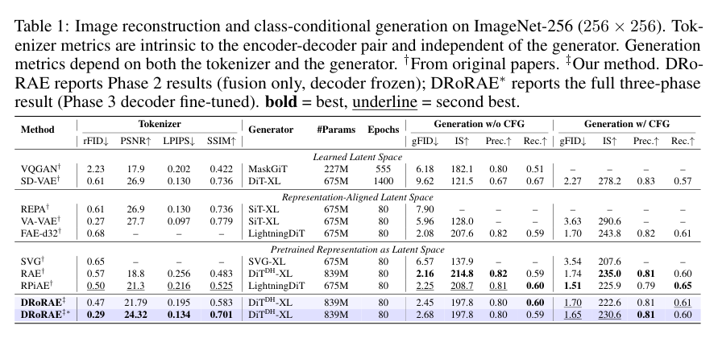
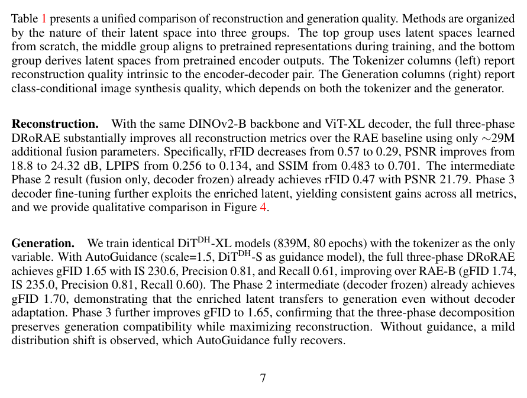

<section class="weekly-paper-page">
  <a class="weekly-back-link" href="/blog/en/2026/05/11/generative-models-weekly-2026-05-11/">Back to weekly overview</a>
  
Generative Models · May 11 - May 17, 2026

  

    A17
    

      <h2>Beyond the Last Layer: Multi-Layer Representation Fusion for Visual Tokenization</h2>
      
Image / visual synthesis

    

  

  <section class="weekly-deep-read weekly-story-v2 weekly-story-essay">
        
tokenizer/VAE 线里最值得看的是表征分层：最后层语义强，低层细节弱；生成任务需要二者共存。 这会影响 reconstruction、generation quality 和后续 diffusion transformer 的输入质量，是基础设施型改进。

        

        
Beyond the Last Layer targets a hard constraint in generative modeling: Fuses multi-layer representations instead of relying only on the last visual-encoder layer.

The useful lens is latent representation / tokenizer reconstruction / semantic-detail allocation: the paper should be read through the variable it changes inside the generation process, not only through final samples.

The paper asks whether the model can make latent representation / tokenizer reconstruction / semantic-detail allocation a trainable and measurable part of the generation process.

The common failure mode is a mismatch between training assumptions, inference state, and evaluation target; the output may look plausible while the system remains hard to reuse.

The method can be compressed as: Multi-layer visual representation fusion to recover details lost in the last layer.

The concrete method clue is: DRoRAE better preserves fine-grained textures, structural details, and color fidelity, particularly in regions with repetitive patterns, thin structures, and high-frequency content that the last-layer representation alone tends to lose.

The reusable part is the middle of the pipeline: how conditions, latent states, or sampling paths are constrained before the final output is rendered.

The reported effect is: The intermediate Phase 2 already reaches rFID 0.47 and PSNR 21.79. Multi-layer tokenization is not cosmetic; low-level detail and high-level semantics affect reconstruction and generation foundations.
<figure class="weekly-inline-figure weekly-inline-figure--wide">

<figcaption>Table 1 p.7</figcaption>
</figure><figure class="weekly-inline-figure weekly-inline-figure--wide">

<figcaption>Table 1 p.7</figcaption>
</figure>
The traceable result clue is: The intermediate Phase 2 result (fusion only, decoder frozen) already achieves rFID 0.47 with PSNR 21.79.

Generation quality increasingly depends on tokenizer/autoencoder representation design. The tokenizer is the input interface for the generation stack; errors propagate downstream.

The next check is whether the mechanism remains stable across data, scale, resolution, and tighter control conditions.

        

        </section>
  
  
arXiv<a href="https://arxiv.org/abs/2605.10780" rel="noopener">https://arxiv.org/abs/2605.10780</a>

</section>
