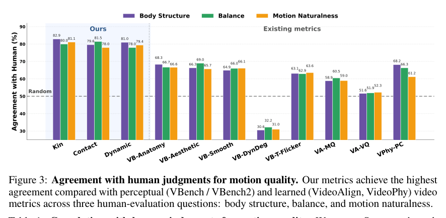
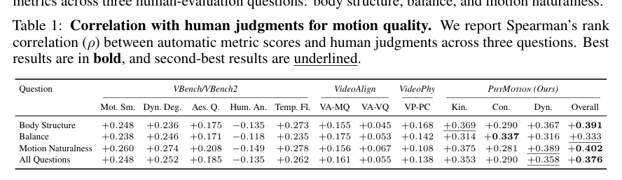

<section class="weekly-paper-page">
  <a class="weekly-back-link" href="/blog/en/2026/05/11/generative-models-weekly-2026-05-11/">Back to weekly overview</a>
  
Generative Models · May 11 - May 17, 2026

  

    A18
    

      <h2>PhyMotion: Structured 3D Motion Reward for Physics-Grounded Human Video Generation</h2>
      
3D / spatial generation

    

  

  <section class="weekly-deep-read weekly-story-v2 weekly-story-essay">
        
视频生成的人体问题需要物理奖励。画面清晰和姿态漂亮不足以保证运动连续、接触合理、重心可信。 人类动作是视频模型最容易露馅的区域，也是广告、短剧、虚拟人最常见需求；reward 设计会决定后训练上限。

        

        
PhyMotion targets a hard constraint in generative modeling: Designs a 3D motion reward for human video generation beyond 2D perceptual rewards.

The useful lens is geometry constraints / correspondence / cross-view consistency: the paper should be read through the variable it changes inside the generation process, not only through final samples.

The paper asks whether the model can make geometry constraints / correspondence / cross-view consistency a trainable and measurable part of the generation process.

The common failure mode is a mismatch between training assumptions, inference state, and evaluation target; the output may look plausible while the system remains hard to reuse.

The method can be compressed as: Structured 3D motion reward constraining post-training with body-state signals.

The concrete method clue is: The same trend also holds for FastWan 1.3B: after post-training withPhyMotion, the model improves motion smoothness, aesthetic quality, temporal flickering, VideoAlign, VideoPhy, and allPhyMotion scores, including a+7.0% gain in overall feasibility.

The reusable part is the middle of the pipeline: how conditions, latent states, or sampling paths are constrained before the final output is rendered.
<figure class="weekly-inline-figure weekly-inline-figure--wide">

<figcaption>Figure 3 p.7</figcaption>
</figure>
The reported effect is: The paper reports clear gains over perceptual, preference-based, and physics-aware reward baselines, which typically reach only 50-66% agreement with weak Spearman correlation. The effect is a reward closer to human-motion judgment.
<figure class="weekly-inline-figure weekly-inline-figure--wide">

<figcaption>Table 1 p.7</figcaption>
</figure>
The traceable result clue is: This substantially outperforms existing perceptual, preference-based, and physics-awarerewardbaselines, whichtypicallyachieve 50–66%agreementandonlyweakSpearman correlations (ρ= 0 –0.25).

Video realism needs physical motion evaluation, not only visual perception. Human motion is a common failure point and a frequent commercial-generation need.

The next check is whether the mechanism remains stable across data, scale, resolution, and tighter control conditions.

        

        </section>
  
  
arXiv<a href="https://arxiv.org/abs/2605.14269" rel="noopener">https://arxiv.org/abs/2605.14269</a>

</section>
