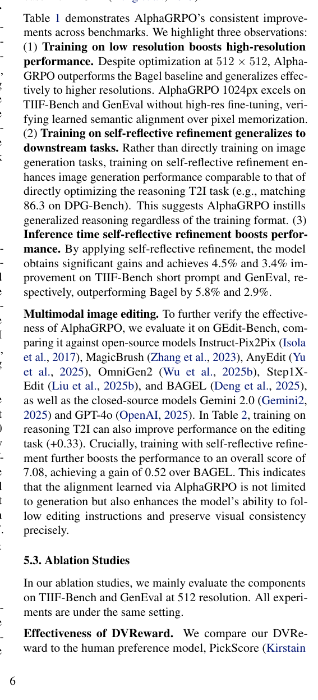
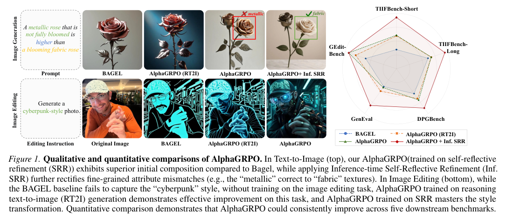

<section class="weekly-paper-page">
  <a class="weekly-back-link" href="/blog/en/2026/05/11/generative-models-weekly-2026-05-11/">Back to weekly overview</a>
  
Generative Models · May 11 - May 17, 2026

  

    A02
    

      <h2>AlphaGRPO: Unlocking Self-Reflective Multimodal Generation in UMMs via Decompositional Verifiable Reward</h2>
      
Image / visual synthesis

    

  

  <section class="weekly-deep-read weekly-story-v2 weekly-story-essay">
        
这篇的信号是：多模态生成开始吸收 LLM post-training 的方法论，质量控制从 prompt engineering 进入 reward design。 复杂图像生成常死在隐含意图、组合约束和自我修正；这类 reward 设计会影响下一代统一多模态模型的训练接口。

        

        
AlphaGRPO targets a hard constraint in generative modeling: Applies GRPO to AR-Diffusion multimodal generation with verifiable rewards.

The useful lens is reward signal / benchmark protocol / evaluation loop: the paper should be read through the variable it changes inside the generation process, not only through final samples.

The paper asks whether the model can make reward signal / benchmark protocol / evaluation loop a trainable and measurable part of the generation process.

The common failure mode is a mismatch between training assumptions, inference state, and evaluation target; the output may look plausible while the system remains hard to reuse.

The method can be compressed as: Decompositional verifiable rewards plus GRPO for post-training complex generation.

The concrete method clue is: .

The reusable part is the middle of the pipeline: how conditions, latent states, or sampling paths are constrained before the final output is rendered.

The reported effect is: The effect is not one headline score; the useful signal is progressive self-reflective refinement under complex constraints. Read it as evidence that reward decomposition can enter multimodal generation post-training.
<figure class="weekly-inline-figure weekly-inline-figure--wide">

<figcaption>Table 1 p.6</figcaption>
</figure><figure class="weekly-inline-figure weekly-inline-figure--wide">

<figcaption>Figure 1 p.2</figcaption>
</figure>
The traceable result clue is: Efficacy of Self-Reflective Refinement.Figure 8 visualizes the progressive improvement brought by our Inference-time Self-Reflective Refinement (Inf.

Multimodal generation is entering RL/post-training, moving from image output to reasoning-aware output. It breaks generation quality into rewardable subgoals, which may change how complex prompts are optimized.

The next check is whether the mechanism remains stable across data, scale, resolution, and tighter control conditions.

        

        </section>
  
  
arXiv<a href="https://arxiv.org/abs/2605.12495" rel="noopener">https://arxiv.org/abs/2605.12495</a>

</section>
