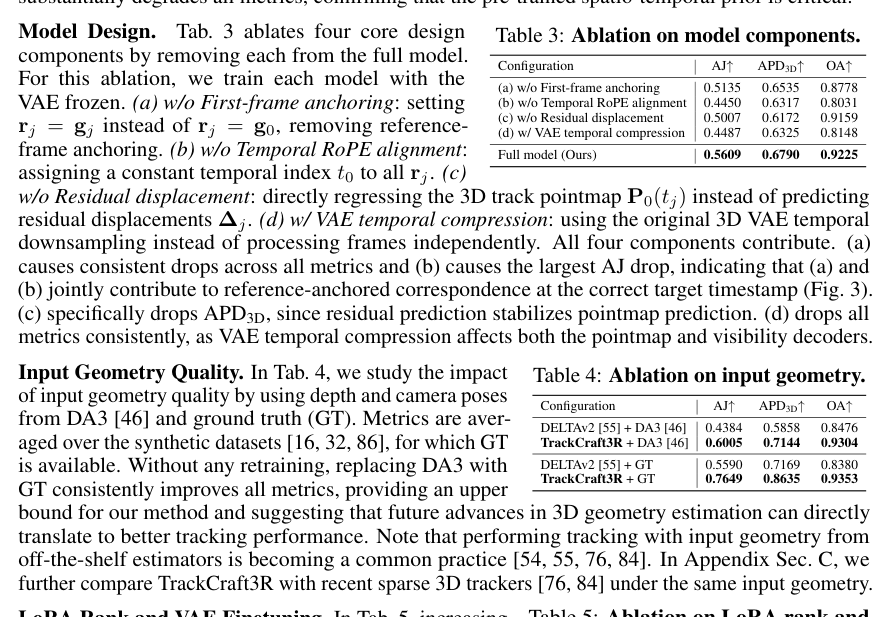
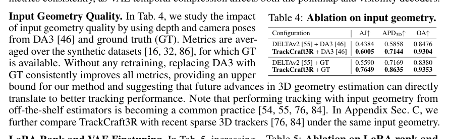

<section class="weekly-paper-page">
  <a class="weekly-back-link" href="/blog/en/2026/05/11/generative-models-weekly-2026-05-11/">Back to weekly overview</a>
  
Generative Models · May 11 - May 17, 2026

  

    A20
    

      <h2>TrackCraft3R: Repurposing Video Diffusion Transformers for Dense 3D Tracking</h2>
      
3D / spatial generation

    

  

  <section class="weekly-deep-read weekly-story-v2 weekly-story-essay">
        
生成模型正在成为感知任务的 prior library。视频 diffusion 学到的运动结构，可以反向服务 tracking。 这篇说明 video generation 的中间能力可能比最终样片更有价值：motion prior 能进入 3D understanding 工具链。

        

        
TrackCraft3R targets a hard constraint in generative modeling: Repurposes video diffusion transformer priors for dense 3D tracking.

The useful lens is geometry constraints / correspondence / cross-view consistency: the paper should be read through the variable it changes inside the generation process, not only through final samples.

The paper asks whether the model can make geometry constraints / correspondence / cross-view consistency a trainable and measurable part of the generation process.

The common failure mode is a mismatch between training assumptions, inference state, and evaluation target; the output may look plausible while the system remains hard to reuse.

The method can be compressed as: Uses motion priors learned by video generators for dynamic 3D scene understanding.

The concrete method clue is: Training.All models are trained at a resolution of 480×832 on 12-frame clips using 8 H200 GPUs.

The reusable part is the middle of the pipeline: how conditions, latent states, or sampling paths are constrained before the final output is rendered.

The reported effect is: Experiments use datasets with sparse ground-truth 3D trajectories and evaluate the first 84 frames. The result is that video-diffusion motion priors transfer to dense 3D tracking.
<figure class="weekly-inline-figure weekly-inline-figure--wide">

<figcaption>Table 3 p.9</figcaption>
</figure><figure class="weekly-inline-figure weekly-inline-figure--wide">

<figcaption>Table 4 p.9</figcaption>
</figure>
The traceable result clue is: Each dataset provides sparse ground-truth 3D trajectories, and we evaluate the first 84 frames.

Generative models are becoming prior libraries for perception, not only content generators. It shows video-generation internals may feed back into 3D tracking and dynamic understanding.

The next check is whether the mechanism remains stable across data, scale, resolution, and tighter control conditions.

        

        </section>
  
  
arXiv<a href="https://arxiv.org/abs/2605.12587" rel="noopener">https://arxiv.org/abs/2605.12587</a>

</section>
