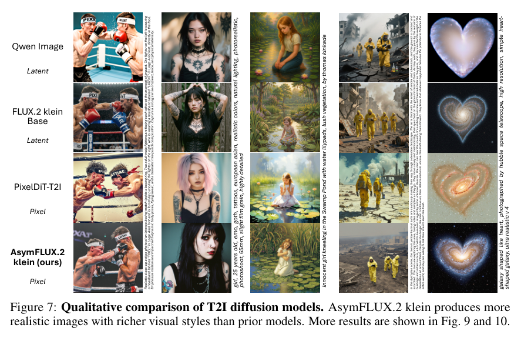
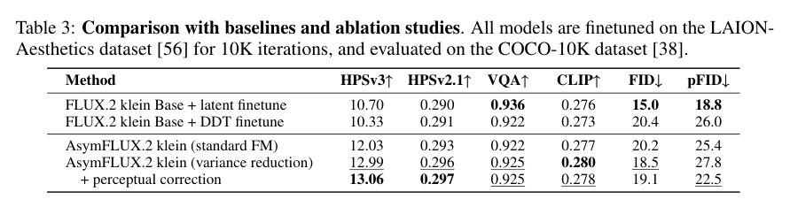

<section class="weekly-paper-page">
  <a class="weekly-back-link" href="/blog/2026/05/11/generative-models-weekly-2026-05-11/">返回周报总览</a>
  
生成模型 · 2026.5.11 - 5.17

  

    A03
    

      <h2>Asymmetric Flow Models</h2>
      
图像 / 视觉合成

    

  

  <section class="weekly-deep-read weekly-story-v2 weekly-story-essay">
        
AsymFlow 把 flow model 的问题从“预测完整高维速度场”改写成“只在有效子空间里预测关键噪声方向”。

        

        
高维生成里的 flow matching 很容易被维度拖累。图像或 latent 空间里有大量自由度，但真正推动样本从噪声走向数据流形的方向未必占满全空间。把每个维度都当成同等重要，会让 velocity prediction 同时学习有效结构和冗余噪声。

AsymFlow 的切入点是把这种冗余显式拿出来处理。它改变 velocity 的参数化：data prediction 保持全维，noise prediction 只在低秩子空间里完成；模型大小不是这里的主要变量。

这篇比较好的地方，是它没有把效率问题只归因于采样步数或网络规模，而是追问每一步 velocity prediction 到底需要多少有效自由度。这个问题更接近生成路径的几何，而非工程压缩。

AsymFlow 关心的是 velocity field 的有效维度。生成路径里并非每个方向都值得同等建模；如果低秩 noise prediction 不损害样本质量，就说明全维速度场里有相当一部分训练预算花在了冗余方向上。

换句话说，它想验证一个更强的假设：data side 需要保留全维表达，noise side 主要负责路径方向选择。两边如果承担不同角色，就不应该被同一种全维参数化强行绑定。

对称预测 noise 和 data 的做法直观，但它隐含一个假设：高维空间里的每个方向都值得同等对待。这个假设在图像生成里很重，因为视觉语义和纹理细节高度相关，velocity field 容易把主导方向和局部扰动混在一起。

这种压力不一定直接表现为参数量，而会体现在采样稳定性、clamping sensitivity 和 ablation 上。AsymFlow 试图证明：只要保留全维 data prediction，noise 侧可以更经济地表达。

这里的 prior gap 重点是目标分解太粗。全维 data prediction 负责还原细节，全维 noise prediction 却可能把许多无效方向也纳入速度场估计，最终让训练把主导路径和局部噪声一起拟合。

AsymFlow 的机制是 asymmetric parameterization。模型仍然预测全维 data 分量，保证生成结果能覆盖细节；noise 分量被限制在低秩子空间，再解析恢复 full-dimensional velocity。这样 velocity field 只把建模预算集中到更贴近数据流形的有效方向。

定性图的作用是检查这个约束是否把模型变成低多样性的生成器。如果低秩 noise 仍能产生丰富风格和细节，说明低秩约束主要在过滤无效方向，而非简单压缩。
<figure class="weekly-inline-figure weekly-inline-figure--float">

<figcaption>Figure 7 p.8</figcaption>
</figure>
这点很关键：低秩重点是把 noise prediction 的更新方向做结构化约束。data 分量仍然给模型保留细节恢复能力，noise 分量则更像路径选择器，决定从噪声往数据流形移动时哪些方向值得用容量。

从训练角度看，AsymFlow 的动作不在更大的 denoiser，而在目标分解。noise prediction 承担主导路径选择，data prediction 保留复原能力；两者的非对称分工让模型在高维空间里少学一部分不必要的速度扰动。

这种非对称也解释了为什么它不只是一个低秩 adapter。adapter 通常是给模型加一个便宜模块；AsymFlow 改的是 flow velocity 的语义分工。它让训练目标本身承认：生成路径的有效子空间和最终样本的像素/latent 自由度不是同一个东西。

实验需要同时看主指标和 ablation。FID / IS 说明样本质量没有被低秩约束破坏；clamping sensitivity 和低秩维度的消融则说明方法收益来自参数化本身，而非偶然的训练调参。
<figure class="weekly-inline-figure weekly-inline-figure--wide">

<figcaption>Table 3 p.8</figcaption>
</figure>
Table 3 的意义在这里：它把 AsymFlow 放到同类 T2I diffusion / flow 模型旁边比较。如果低秩 noise prediction 在指标上仍然占优，就支持一个判断：生成模型的效率瓶颈不限于 step 数，也来自 velocity field 的表达方式。

Figure 7 则是必要的 sanity check。低秩约束如果只是把模型推向平均模板，主指标可能短期好看，但图像风格会变窄；定性结果至少说明这个约束没有明显牺牲视觉覆盖面。

这篇提供了一个有用的几何直觉：sampling path 的成本来自两部分，一部分是走多少步，另一部分是每一步要在多大的有效空间里估计方向。AnyFlow 处理步数弹性，AsymFlow 处理速度场参数化，它们其实在回答同一个底层问题：生成路径如何变得更经济。

更 senior 的 takeaway 是：生成模型的效率优化不能只盯 scheduler。scheduler 决定走几步，velocity parameterization 决定每一步估计什么方向。两者合起来才是 sampling path 的真实成本。

下一步检验很直接：低秩约束能否承受细粒度编辑、多对象组合和长文本排版。如果任务条件改变后有效子空间也随之变化，固定 rank 可能需要变成动态 rank 或条件化子空间。

        

        </section>
  
  
arXiv 链接<a href="https://arxiv.org/abs/2605.12964" rel="noopener">https://arxiv.org/abs/2605.12964</a>

</section>
