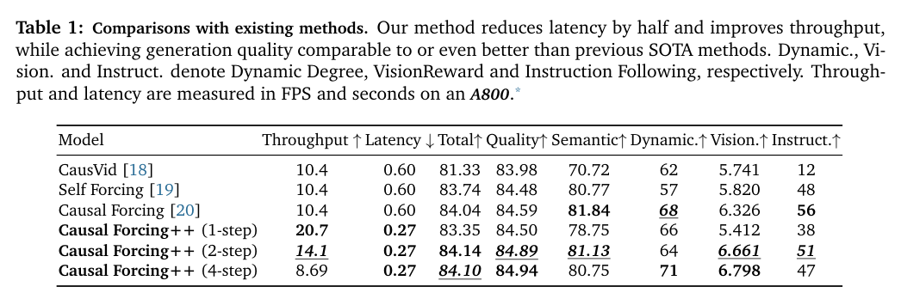
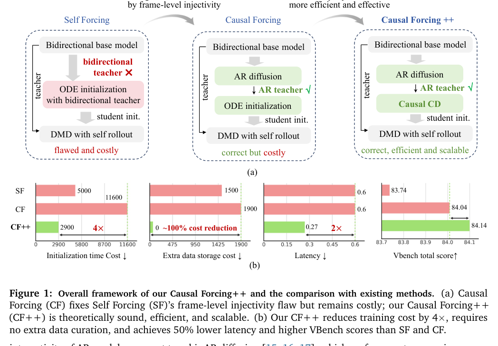

<section class="weekly-paper-page">
  <a class="weekly-back-link" href="/blog/en/2026/05/11/generative-models-weekly-2026-05-11/">Back to weekly overview</a>
  
Generative Models · May 11 - May 17, 2026

  

    A04
    

      <h2>Causal Forcing++: Scalable Few-Step Autoregressive Diffusion Distillation for Real-Time Interactive Video Generation</h2>
      
Video / temporal generation

    

  

  <section class="weekly-deep-read weekly-story-v2 weekly-story-essay">
        
实时视频生成的评价坐标是 latency、control granularity、rollout stability。离线 clip 质量只是入口。 它直接决定视频模型能否成为交互工具：用户改动作、镜头或场景时，系统必须在可接受延迟内继续生成。

        

        
Causal Forcing++ targets a hard constraint in generative modeling: Pushes autoregressive diffusion distillation toward lower-latency interactive video generation.

The useful lens is temporal state / history cache / rollout stability: the paper should be read through the variable it changes inside the generation process, not only through final samples.

The paper asks whether the model can make temporal state / history cache / rollout stability a trainable and measurable part of the generation process.

The common failure mode is a mismatch between training assumptions, inference state, and evaluation target; the output may look plausible while the system remains hard to reuse.

The method can be compressed as: Few-step AR diffusion distillation to reduce response granularity and sampling latency.

The concrete method clue is: .

The reusable part is the middle of the pipeline: how conditions, latent states, or sampling paths are constrained before the final output is rendered.

The reported effect is: Ablations show causal CD matches or outperforms causal ODE initialization across 1/2/4-step settings while reducing Stage 2 cost by about 4x. The result points to few-step rollout for real-time video.
<figure class="weekly-inline-figure weekly-inline-figure--wide">

<figcaption>Table 1 p.10</figcaption>
</figure><figure class="weekly-inline-figure weekly-inline-figure--wide">

<figcaption>Figure 1 p.3</figcaption>
</figure>
The traceable result clue is: Ablation studies further show that causal CD consistently matches or outperforms causal ODE initialization across 1-step, 2-step, and 4step settings, while reducing the Stage 2 cost by about 4× and requiring no auxiliary trajectory storage.

Interactive video generation is judged by latency and controllable rollout, not offline clip scores. It affects whether video models become real-time tools rather than offline renderers.

The next check is whether the mechanism remains stable across data, scale, resolution, and tighter control conditions.

        

        </section>
  
  
arXiv<a href="https://arxiv.org/abs/2605.15141" rel="noopener">https://arxiv.org/abs/2605.15141</a>

</section>
