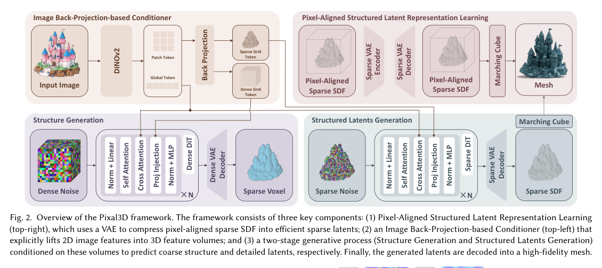
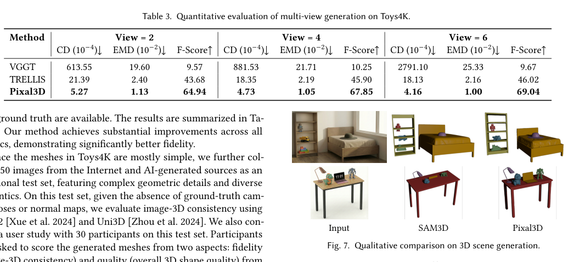

<section class="weekly-paper-page">
  <a class="weekly-back-link" href="/blog/en/2026/05/11/generative-models-weekly-2026-05-11/">Back to weekly overview</a>
  
Generative Models · May 11 - May 17, 2026

  

    A05
    

      <h2>Pixal3D: Pixel-Aligned 3D Generation from Images</h2>
      
3D / spatial generation

    

  

  <section class="weekly-deep-read weekly-story-v2 weekly-story-essay">
        
3D 生成继续往资产生产靠拢，瓶颈从“形状像”推进到“输入细节能否被忠实绑定到空间”。 商品、角色、IP 资产都依赖这种 fidelity；少了 correspondence，image-to-3D 很难进入可复用生产链路。

        

        
Pixal3D targets a hard constraint in generative modeling: Treats pixel-level alignment as the core issue in image-to-3D generation.

The useful lens is geometry constraints / correspondence / cross-view consistency: the paper should be read through the variable it changes inside the generation process, not only through final samples.

The paper asks whether the model can make geometry constraints / correspondence / cross-view consistency a trainable and measurable part of the generation process.

The common failure mode is a mismatch between training assumptions, inference state, and evaluation target; the output may look plausible while the system remains hard to reuse.

The method can be compressed as: Improves image-to-3D geometry and appearance through 2D-3D correspondence.

The concrete method clue is: 3 Method Pixal3D introduces a pixel-aligned 3D generation paradigm and proposes a back-projection-based image condition scheme into a 3D latent diffusion model.

The reusable part is the middle of the pipeline: how conditions, latent states, or sampling paths are constrained before the final output is rendered.

The reported effect is: Evaluation covers quantitative and qualitative single-view 3D generation against representative methods. The important effect is better traceability from input pixels to the generated 3D asset.
<figure class="weekly-inline-figure weekly-inline-figure--wide">

<figcaption>Figure 2 p.4</figcaption>
</figure><figure class="weekly-inline-figure weekly-inline-figure--wide">

<figcaption>Figure 7 p.9</figcaption>
</figure>
The traceable result clue is: 4 Experiments 4.1 Single-view 3D Generation To validate the effectiveness of our Pixal3D framework, we conduct comprehensive quantitative and qualitative evaluations against representative state-of-the-art 3D generation methods, including TRELLIS [Xiang et al.

The bottleneck is not just looking 3D, but faithfully preserving the input image. This decides whether image-to-3D can support product, character, and asset pipelines.

The next check is whether the mechanism remains stable across data, scale, resolution, and tighter control conditions.

        

        </section>
  
  
arXiv<a href="https://arxiv.org/abs/2605.10922" rel="noopener">https://arxiv.org/abs/2605.10922</a>

</section>
