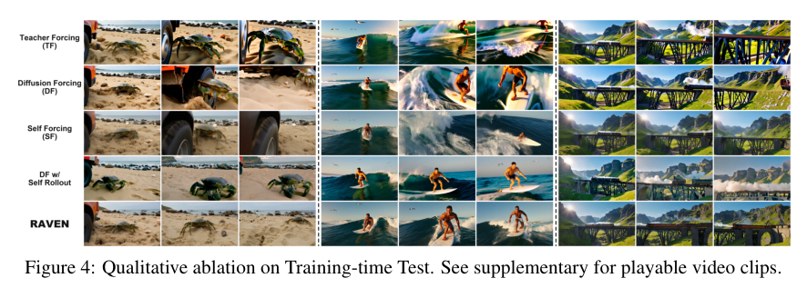
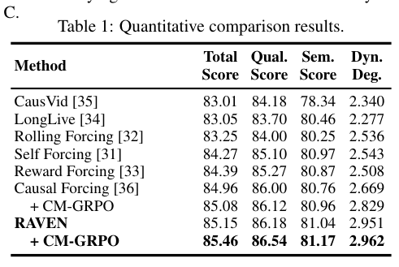

<section class="weekly-paper-page">
  <a class="weekly-back-link" href="/blog/2026/05/11/generative-models-weekly-2026-05-11/">返回周报总览</a>
  
生成模型 · 2026.5.11 - 5.17

  

    A06
    

      <h2>RAVEN: Real-time Autoregressive Video Extrapolation with Consistency-model GRPO</h2>
      
视频 / 时序生成

    

  

  <section class="weekly-deep-read weekly-story-v2 weekly-story-essay">
        
实时视频生成的关键问题正在变成 online distribution shift：模型必须学会和自己的输出共处。 它和 AnyFlow、Causal Forcing++ 组成同一条线：短视频 diffusion 的质量优势要转换成可交互、可持续的实时生成。

        

        
RAVEN 把生成质量的瓶颈前移到表征层：RAVEN 面向实时流式视频外推，处理 autoregressive rollout 中训练历史和推理历史的分布偏移。

视频模型的难点已经从单帧质量转到时间轴：采样预算、历史状态、控制信号和长程一致性必须同时成立。

这篇的分量取决于 latent 表征 / tokenizer 重建 / 语义-细节分配 有没有成为模型设计的一部分。如果它只出现在输出解释里，方法价值会很薄；如果它进入训练目标、采样路径或中间表征，就会影响模型的可迁移性。

模型能否在延迟受限、状态持续变化的条件下继续生成，离线 clip 上的几秒样例只能算入口。

如果 latent 表征 / tokenizer 重建 / 语义-细节分配 只停留在输出端修补，模型规模变大也未必解决问题；如果它进入训练目标、采样路径或中间表征，方法才可能迁移到更严格的条件下。

旧路线常把训练片段和部署 rollout 分开看。训练时看到的是干净上下文，推理时面对的是自己刚生成的历史；误差、运动状态和控制条件会沿时间轴累积。

这类错误往往不在单个样例里出现，而是在分辨率、时长、控制强度或输入复杂度增加后被放大。生成模型一旦进入工具链，这种放大会比单次视觉质量更要命。

方法上的转折是：用 consistency-model GRPO 优化长程 rollout，让模型在自己生成的历史上继续生成时更稳。

更重要的是责任分配发生了变化：latent 表征 / tokenizer 重建 / 语义-细节分配 从评测时才出现的现象，前移成模型需要学习或保持的内部结构。

机制判断要看状态如何传递：teacher 信号、history cache、timestep 或 camera condition 在哪一步进入模型，决定了它是一次性样例生成还是可连续调用的系统。

因此阅读重点要从模块名转向 latent 表征 / tokenizer 重建 / 语义-细节分配 进入计算图的位置：训练目标、采样路径和中间表征看似都在“加约束”，实际改变的是完全不同的责任边界。

从执行链路看，输入条件先被转成模型状态，约束再通过中间表征、采样路径或训练目标生效，最后才成为图像、视频或三维结果。

RAVEN 的可迁移价值主要在中间环节：只要 latent 表征 / tokenizer 重建 / 语义-细节分配 的处理方式不依赖某个固定样例，就有机会迁移到更大的模型、更多数据或更复杂的控制条件。

Figure 4 p.8；Table 1 p.7 对应的是文中最值得核对的机制或实验比较。

实验给出的直接信号是：结果把 TF / SF 的取舍拆开：motion、semantic alignment、visual fidelity 很难同时最优。RAVEN 的价值在把 streaming video 的分布偏移显式拿出来优化。
<figure class="weekly-inline-figure weekly-inline-figure--wide">

<figcaption>Figure 4 p.8</figcaption>
</figure><figure class="weekly-inline-figure weekly-inline-figure--wide">

<figcaption>Table 1 p.7</figcaption>
</figure>
结果要优先看延迟、吞吐、长程稳定和控制一致性，再看单张样例。视频系统的价值在连续可用，不在挑一帧最漂亮。

把结果放回 latent 表征 / tokenizer 重建 / 语义-细节分配，需要看变量变化时质量、效率和稳定性是否同步变化。单个最优点不够，稳定的退化曲线更能说明方法质量。

实时视频生成的关键问题正在变成 online distribution shift：模型必须学会和自己的输出共处。 它和 AnyFlow、Causal Forcing++ 组成同一条线：短视频 diffusion 的质量优势要转换成可交互、可持续的实时生成。

这类工作把视频生成推向真实工具链：同一模型要能预览、交互、延展和最终渲染，质量曲线必须和成本曲线一起读。

这也是它在本周目录里的位置：它把 latent 表征 / tokenizer 重建 / 语义-细节分配 从附属现象变成可讨论的设计对象。

后面应继续看两件事：latent 表征 / tokenizer 重建 / 语义-细节分配 在更大模型上是否仍然成立，以及控制条件变紧时是否出现清晰、可解释的退化。

        

        </section>
  
  
arXiv 链接<a href="https://arxiv.org/abs/2605.15190" rel="noopener">https://arxiv.org/abs/2605.15190</a>

</section>
