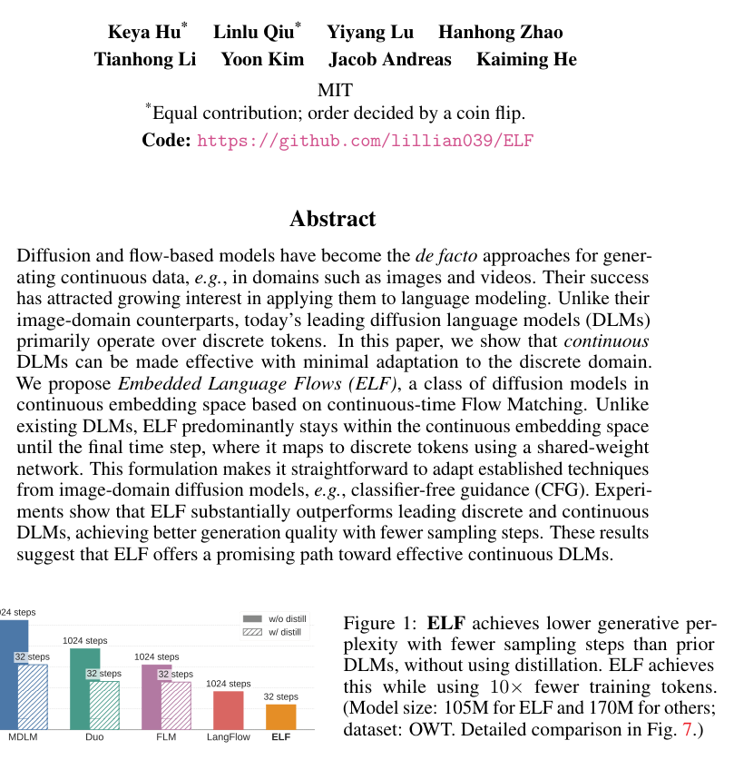
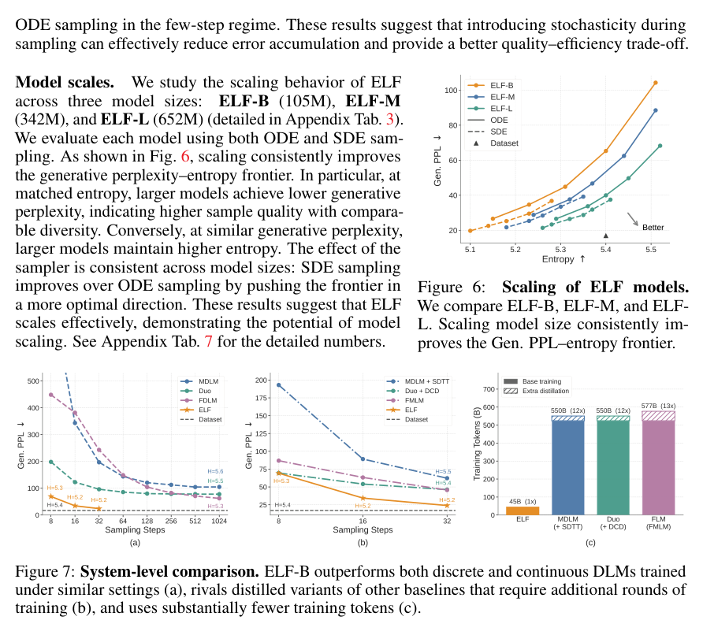

<section class="weekly-paper-page">
  <a class="weekly-back-link" href="/blog/2026/05/11/generative-models-weekly-2026-05-11/">返回周报总览</a>
  
生成模型 · 2026.5.11 - 5.17

  

    A07
    

      <h2>ELF: Embedded Language Flows</h2>
      
图像 / 视觉合成

    

  

  <section class="weekly-deep-read weekly-story-v2 weekly-story-essay">
        
这篇值得放在最前面，因为它把 flow 当成生成建模的通用数学对象，而非图像专属技巧。 如果这条线跑通，language / image / video 的 sampling path 可以在同一层比较，多模态模型会少一个概念断层。

        

        
ELF 的切入点很具体：把 diffusion / flow 的连续建模搬到语言嵌入空间，目标是减少纯离散 token 扩散的接口损耗。

当前图像与多模态生成的瓶颈越来越多地前移到 tokenizer、VAE、latent 和解码接口。

论文开头已经把问题形状讲清楚：Diffusion and flow-based models have become thede factoapproaches for generating continuous data,e.g., in domains such as images and videos. Their success has attracted growing interest in applying them to language modeling. Unlike their image-domain counterparts, today’s leading diffusion language models (DLMs) primar。读这类工作，要看方法是否改变生成过程里的真实瓶颈，而不只看样例。

表征层能否同时保留语义、文字、细节和吞吐，而不把问题留给后面的 denoiser 或 autoregressive decoder 补救。

在本周关键词中，它对应 latent 表征 / tokenizer 重建 / 语义-细节分配。这里的关键词指向本文真正改动的位置：模型在哪里少走弯路、少丢信息，或者少依赖人工挑样例。

只优化主干模型容易误判瓶颈。压缩层丢掉文字和局部结构，解码器再强也只能修补；token 生成接口太慢，系统吞吐会直接卡死。

这类缺口经常隐藏在系统边界里：训练时条件干净，部署时条件会漂；论文里看的是局部指标，用户面对的是完整生成链路。好的方法必须把这个缝隙显式收进模型或评测。

方法可以先压成一句：在 embedding space 里建模 language flow，再把连续状态映射回 token；关键技术点是连续轨迹和离散输出之间的桥接。

方法段可核对的线索是：The survey summarizes representative continuous diffusion and flow-based language models along several design axes, including the underlying diffusion or flow process, the continuous state in which denoising is performed, whether intermediate denoising states are discretized during training or infer。

机制判断要看信息在哪里被压缩、融合或并行化：多层特征、latent channel、large patch、dual-view decoding 都是在重新分配表征预算。

因此本文的机制重点是重新安排 latent 表征 / tokenizer 重建 / 语义-细节分配 的责任边界：哪些变量由模型内部学习，哪些变量由训练目标约束，哪些变量在推理时变成可调接口。

按执行链路看，第一步是把输入条件变成模型可用的状态，第二步是在中间表征或采样路径上施加约束，第三步才是输出图像、视频或三维结果。

ELF 的可复用部分主要在第二步。只要这个中间约束成立，方法就有机会迁移到更大的模型、更多数据或更复杂的控制条件；如果它只在最后输出端修补，扩展性会弱很多。

机制图和结果表要贴着正文读：它们固定比较对象、指标和消融变量，能帮助判断方法是否真的改到了计算路径或评价协议。

结果部分的硬信号是：实验主要看 generative perplexity / entropy 随 CFG scale 的取舍：guidance 越强，PPL 会降，但多样性同步收紧。可读结论是 ELF 在语言嵌入空间里确实形成了可调 sampling trade-off。
<figure class="weekly-inline-figure weekly-inline-figure--wide">

<figcaption>Figure 1 p.1</figcaption>
</figure><figure class="weekly-inline-figure weekly-inline-figure--wide">

<figcaption>Figure 7 p.8</figcaption>
</figure>
结果部分给出的细节是：PPL CFG=0.5 CFG=1 CFG=1.5 CFG=2 CFG=2.5 CFG=3 Better Figure 4:Ablations on guidance.We evaluate the generative perplexity–entropy trade-off across CFG scales: increasing the scale lowers generative perplexity but reduces entropy。

图表给出的定位是：p.1 的 Figure 1：ELF achieves lower generative per- plexity with fewer sampling steps than prior DLMs, without using distillation. ELF achieves this while using 10 × fewer training tokens. (Model s；p.8 的 Figure 7：System-level comparison. ELF-B outperforms both discrete and continuous DLMs trained under similar settings (a), rivals distilled variants of other baselines that require additiona。这里重点看比较对象、指标和消融变量，避免把单个样例误读成完整证据。

结果要把 reconstruction、generation quality、文字/版式能力和吞吐放在一起看。单个视觉指标不能覆盖表征层的全部后果。

这篇值得放在最前面，因为它把 flow 当成生成建模的通用数学对象，而非图像专属技巧。 如果这条线跑通，language / image / video 的 sampling path 可以在同一层比较，多模态模型会少一个概念断层。

这类论文的意义是基础设施级的：表征层一旦改好，会抬高后续生成、编辑、排版和高分辨率输出的共同上限。

ELF 进入周报的原因很直接：它在 latent 表征 / tokenizer 重建 / 语义-细节分配 上给了可复用的设计信号。后续同类工作如果无法解释这一层变量，单靠更大模型或更漂亮样例说服力会下降。

后续观察重点是跨数据、跨分辨率、跨条件的稳定性。真正有价值的生成方法，不只在作者设定下有效，还要在约束变紧时保持可解释的退化曲线。

        

        </section>
  
  
arXiv 链接<a href="https://arxiv.org/abs/2605.10938" rel="noopener">https://arxiv.org/abs/2605.10938</a>

</section>
