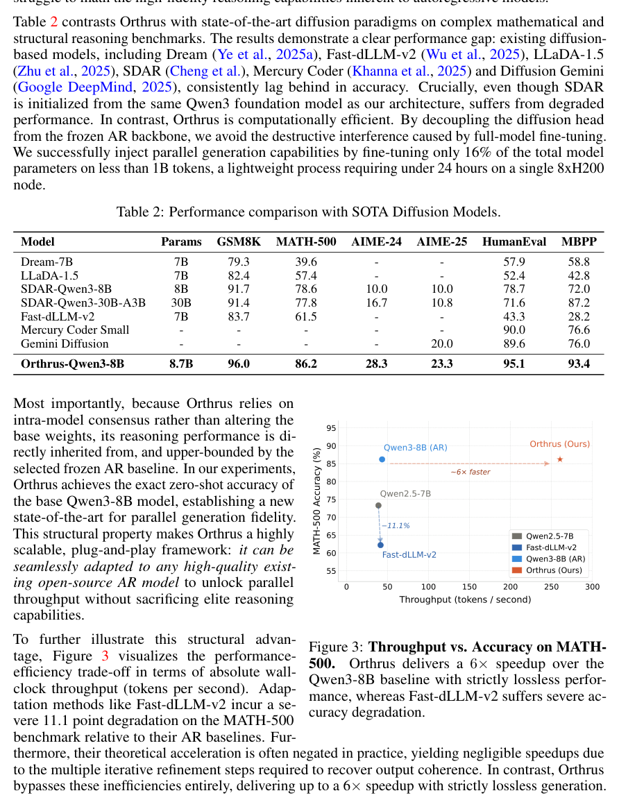
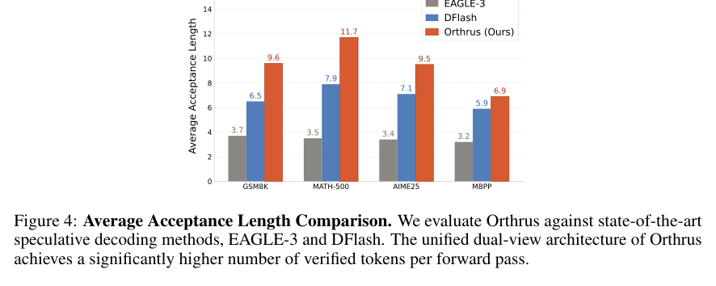

<section class="weekly-paper-page">
  <a class="weekly-back-link" href="/blog/en/2026/05/11/generative-models-weekly-2026-05-11/">Back to weekly overview</a>
  
Generative Models · May 11 - May 17, 2026

  

    A08
    

      <h2>Orthrus: Memory-Efficient Parallel Token Generation via Dual-View Diffusion</h2>
      
Image / visual synthesis

    

  

  <section class="weekly-deep-read weekly-story-v2 weekly-story-essay">
        
diffusion 的价值正在外溢到 token generation。这里的关键词是生成过程并行化：把 diffusion 看成吞吐工具。 它对应部署侧最硬的瓶颈：自回归解码慢。生成建模路线如果能改变 token 生成吞吐，会反过来影响多模态系统架构。

        

        
Orthrus targets a hard constraint in generative modeling: Uses a dual-view diffusion framework to speed token generation while preserving autoregressive fidelity.

The useful lens is latent representation / tokenizer reconstruction / semantic-detail allocation: the paper should be read through the variable it changes inside the generation process, not only through final samples.

The paper asks whether the model can make latent representation / tokenizer reconstruction / semantic-detail allocation a trainable and measurable part of the generation process.

The common failure mode is a mismatch between training assumptions, inference state, and evaluation target; the output may look plausible while the system remains hard to reuse.

The method can be compressed as: A dual architecture combining autoregressive exactness with diffusion-style parallel generation.

The concrete method clue is: Standard speculative frameworks rely on training a distinct drafter model to rapidly project candidate tokens, which the larger base model subsequently verifies.

The reusable part is the middle of the pipeline: how conditions, latent states, or sampling paths are constrained before the final output is rendered.

The reported effect is: The experiments stress parallel token generation under long context and masked blocks. The result is about memory / throughput, not visual quality: dual-view diffusion reduces deployment cost in autoregressive generation.
<figure class="weekly-inline-figure weekly-inline-figure--wide">

<figcaption>Table 2 p.8</figcaption>
</figure><figure class="weekly-inline-figure weekly-inline-figure--wide">

<figcaption>Figure 4 p.9</figcaption>
</figure>
The traceable result clue is: For each training instance, we construct a clean text context with a maximum length of 2048 tokens and generate a corresponding corrupted sequence containing 256 masked blocks placed at random anchor positions.

Diffusion is spilling beyond visual generation into inference throughput and token-generation efficiency. It targets the deployment bottleneck of slow autoregressive decoding.

The next check is whether the mechanism remains stable across data, scale, resolution, and tighter control conditions.

        

        </section>
  
  
arXiv<a href="https://arxiv.org/abs/2605.12825" rel="noopener">https://arxiv.org/abs/2605.12825</a>

</section>
