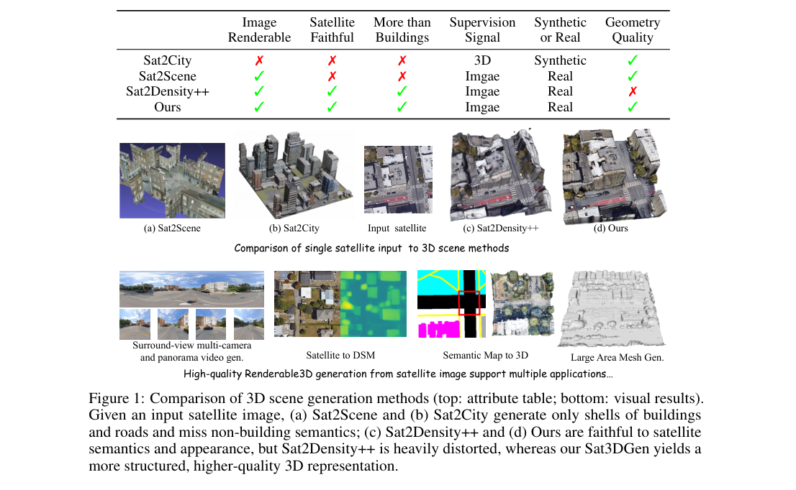
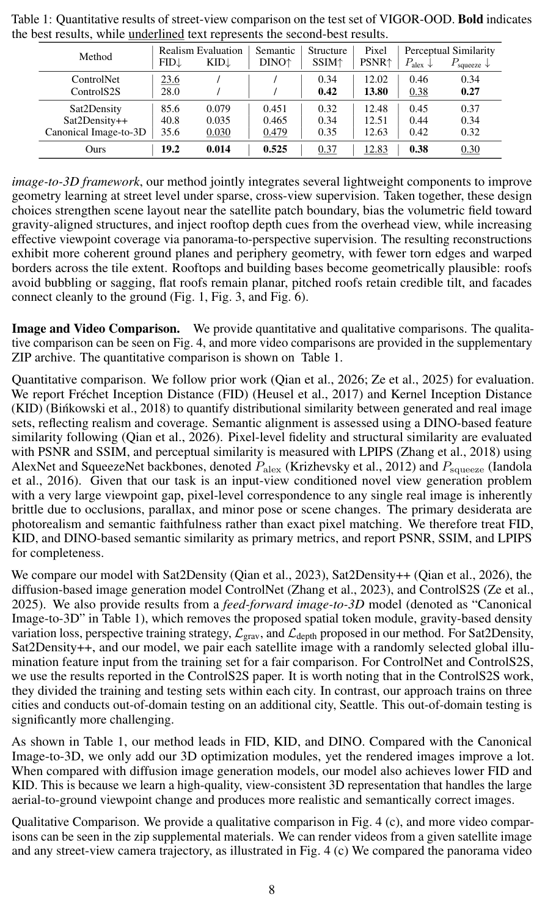

<section class="weekly-paper-page">
  <a class="weekly-back-link" href="/blog/2026/05/11/generative-models-weekly-2026-05-11/">返回周报总览</a>
  
生成模型 · 2026.5.11 - 5.17

  

    A09
    

      <h2>Sat3DGen: Comprehensive Street-Level 3D Scene Generation from Single Satellite Image</h2>
      
3D / 空间生成

    

  

  <section class="weekly-deep-read weekly-story-v2 weekly-story-essay">
        
3D 生成正在从物体级资产扩展到地理条件场景生成；输入条件从照片进入 satellite map。 地图、仿真、城市数字孪生和游戏场景都会用到这类能力。真正要看的指标是几何可信度、语义覆盖和可导航性。

        

        
Sat3DGen 的核心变量是空间对应关系：Sat3DGen 从单张卫星图生成街景级 3D scene，连接遥感视角和可漫游空间资产。

3D 生成首先要看几何、语义和输入条件之间的对应关系。外观相似只是入口，空间结构可追踪才决定结果能否进入资产链路。

这篇的分量取决于 几何约束 / correspondence / 跨视角一致性 有没有成为模型设计的一部分。如果它只出现在输出解释里，方法价值会很薄；如果它进入训练目标、采样路径或中间表征，就会影响模型的可迁移性。

模型能否把二维条件、运动先验或物理约束稳定落到三维结构上，让结果可以被编辑、导航或复用。

如果 几何约束 / correspondence / 跨视角一致性 只停留在输出端修补，模型规模变大也未必解决问题；如果它进入训练目标、采样路径或中间表征，方法才可能迁移到更严格的条件下。

只用视觉相似度会掩盖几何错误。形状、接触、遮挡、轨迹和语义区域一旦错位，样例看起来完整，资产或下游感知仍然不可用。

这类错误往往不在单个样例里出现，而是在分辨率、时长、控制强度或输入复杂度增加后被放大。生成模型一旦进入工具链，这种放大会比单次视觉质量更要命。

方法上的转折是：在 geometry、texture、semantic diversity 之间做联合建模，处理 building-focused 方法和 proxy-based 方法各自的短板。

更重要的是责任分配发生了变化：几何约束 / correspondence / 跨视角一致性 从评测时才出现的现象，前移成模型需要学习或保持的内部结构。

机制判断要看对应关系：像素到表面、卫星图到街景、视频运动到 3D trajectory，约束进入模型的位置决定了空间结构是否可信。

因此阅读重点要从模块名转向 几何约束 / correspondence / 跨视角一致性 进入计算图的位置：训练目标、采样路径和中间表征看似都在“加约束”，实际改变的是完全不同的责任边界。

从执行链路看，输入条件先被转成模型状态，约束再通过中间表征、采样路径或训练目标生效，最后才成为图像、视频或三维结果。

Sat3DGen 的可迁移价值主要在中间环节：只要 几何约束 / correspondence / 跨视角一致性 的处理方式不依赖某个固定样例，就有机会迁移到更大的模型、更多数据或更复杂的控制条件。

Figure 1 p.2；Table 1 p.8 对应的是文中最值得核对的机制或实验比较。

实验给出的直接信号是：评测同时看 realism、semantic structure、perceptual similarity 等指标。它的效果不应只按样例图判断，而要看 satellite input 到 street-level 3D scene 的几何和语义覆盖。
<figure class="weekly-inline-figure weekly-inline-figure--wide">

<figcaption>Figure 1 p.2</figcaption>
</figure><figure class="weekly-inline-figure weekly-inline-figure--wide">

<figcaption>Table 1 p.8</figcaption>
</figure>
结果要同时看几何指标、语义覆盖、物理一致性和定性样例；单一视觉分数不足以说明三维结果可用。

把结果放回 几何约束 / correspondence / 跨视角一致性，需要看变量变化时质量、效率和稳定性是否同步变化。单个最优点不够，稳定的退化曲线更能说明方法质量。

3D 生成正在从物体级资产扩展到地理条件场景生成；输入条件从照片进入 satellite map。 地图、仿真、城市数字孪生和游戏场景都会用到这类能力。真正要看的指标是几何可信度、语义覆盖和可导航性。

这条线的价值在资产生产和空间理解。生成模型如果能输出可追踪几何，就不只是造图，而是在提供可复用的世界表示。

这也是它在本周目录里的位置：它把 几何约束 / correspondence / 跨视角一致性 从附属现象变成可讨论的设计对象。

后面应继续看两件事：几何约束 / correspondence / 跨视角一致性 在更大模型上是否仍然成立，以及控制条件变紧时是否出现清晰、可解释的退化。

        

        </section>
  
  
arXiv 链接<a href="https://arxiv.org/abs/2605.14984" rel="noopener">https://arxiv.org/abs/2605.14984</a>

</section>
