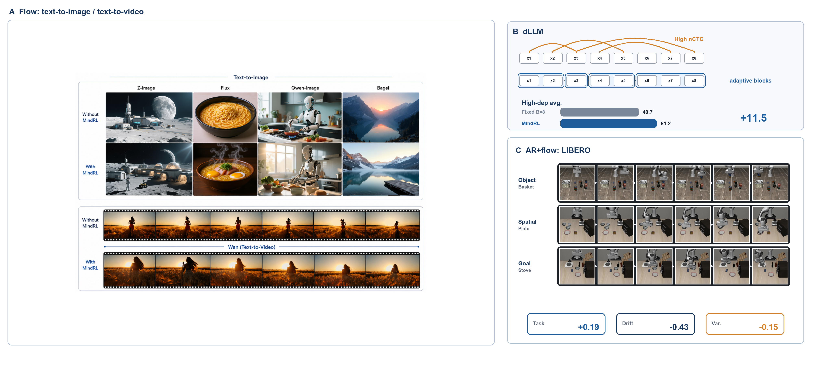
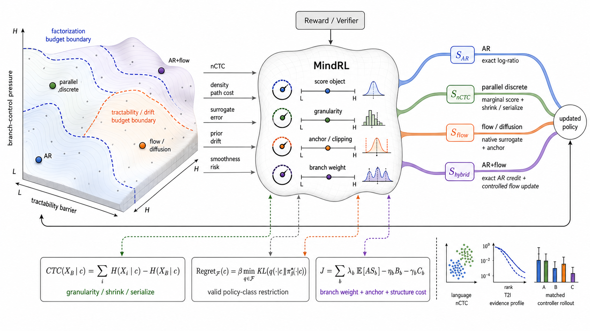
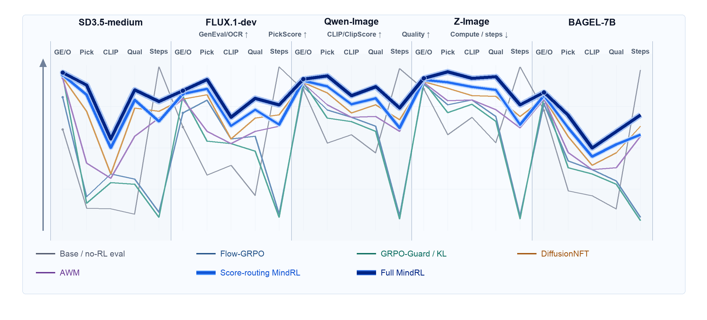

> Status: pre-arXiv draft. arXiv: coming soon.

## Project Thesis

**MindRL is a reward-to-update interface controller for generative RL.** The paper starts from a constraint that is easy to hide in autoregressive language models: reward is only a scalar until a policy branch supplies the probability object, score, or controlled surrogate that can turn it into an update.

## TL;DR

Autoregressive language-model RL makes reward look more universal than it is. Every sampled token has an exact softmax probability, so PPO, DPO, GRPO-style token ratios, KL penalties, and token credit assignment have a natural place to attach.

Modern generative policies do not always expose that interface. Parallel discrete models update many positions at once. Flow and diffusion policies generate continuous, coupled objects such as image/video latents or robot action chunks. Hybrid VLA policies may use AR tokens for plans and a flow head for actions. The reward can still be shared across these branches, but the update path cannot be assumed to be the same.

MindRL asks the interface question explicitly:

> Given a reward, which branch-native object makes this reward a valid update?

For AR branches, the answer can be exact token ratios. For parallel discrete branches, the issue is within-block dependence, measured by Conditional Total Correlation (CTC, not Connectionist Temporal Classification) and controlled by block size or selective serialization. For flow/diffusion branches, the issue is density-ratio tractability and surrogate drift, controlled by path-density evaluation, native surrogates, anchors, clipping, reranking, and branch weights.

That gives the operating rule of the paper: keep exact branches exact, spend granularity on parallel discrete branches, and spend surrogate and anchor budgets on flow branches.



*Figure 1. MindRL treats AR tokens, parallel discrete blocks, flow/diffusion outputs, and AR+flow hybrids as different update interfaces. The same reward can be shared, but the score object and control budget must be branch-native.*

## The Problem: Reward Is Not the Update Interface

An autoregressive language model exposes the object that token-level RL wants. A sampled sequence is decomposed as

<div class="math-display">
$$
\pi_{\mathrm{AR}}(x_{1:T}\mid C)=\prod_{t=1}^{T}\pi(x_t\mid x_{<t},C).
$$
</div>

This factorization gives per-token probabilities under the old and new policies. Token ratios and KL regularization are not mysterious in this setting; the model already gives the probability object through which reward can act.

The same instinct becomes fragile once the policy family changes.

Parallel discrete policies, including masked or diffusion-style language models, can update multiple positions in one step. This reduces sequential depth, but it also hides dependence among the positions committed together. If the model independently commits a block of tokens whose correct values are coupled, the branch is not exposing the joint object the reward would need.

Flow and diffusion policies have a different failure mode. They preserve smooth, coupled structure over continuous outputs, but they often do not expose cheap endpoint likelihood ratios. A token-style GRPO wrapper can raise reward while also increasing drift, jerk, collision risk, or feasibility failures, because the branch was never optimized through a native continuous-policy score.

Hybrid AR+flow policies make the boundary explicit. An embodied policy might generate a symbolic plan with AR tokens and a continuous action chunk with a flow head. The plan branch can use exact token credit. The action branch needs a controlled continuous surrogate and anchors. Treating the whole policy as one token sequence erases the part of the model where the update is actually approximate.

MindRL is built around this boundary.

## Theory Backbone

The formal part of the paper begins with the standard KL-regularized RL objective. For a fixed context \(c\), reference policy \(\pi_0(\cdot\mid c)\), reward \(r(a,c)\), and temperature \(\beta>0\), define

<div class="math-display">
$$
J_c(\pi)
=
\mathbb{E}_{a\sim \pi(\cdot\mid c)}[r(a,c)]
-
\beta\,\mathrm{KL}\!\left(\pi(\cdot\mid c)\,\|\,\pi_0(\cdot\mid c)\right).
$$
</div>

If the policy class were unrestricted, the optimizer would be the soft-optimal policy

<div class="math-display">
$$
\pi_\beta^\star(a\mid c)
=
\frac{\pi_0(a\mid c)\exp(r(a,c)/\beta)}{Z_\beta(c)}.
$$
</div>

This already changes the question. The reward induces a target distribution. The update is only legitimate if the model family exposes an object that can move toward that target.

For any restricted policy family \(\mathcal{F}\), the projection-regret identity says

<div class="math-display">
$$
\max_{\pi} J_c(\pi)-\max_{\pi\in\mathcal{F}}J_c(\pi)
=
\beta \min_{q\in\mathcal{F}}
\mathrm{KL}\!\left(q(\cdot\mid c)\,\|\,\pi_\beta^\star(\cdot\mid c)\right).
$$
</div>

For this paper, the identity is used as an interface test:

1. The reward defines a soft target \(\pi_\beta^\star\).
2. A policy branch can only chase that target through the distributional object it exposes.
3. If the branch exposes the wrong object, the loss is not only optimization noise; it is an interface mismatch.

MindRL calls an update **branch-valid** only when the branch supplies either the exact KL-RL score required by its family or a surrogate whose error is explicitly controlled by anchors, clipping, or branch weights.

### Barrier I: Parallel Discrete Factorization

Let \(M\) be a set of positions updated in one parallel decision step, and let \(X_M=\{X_i\}_{i\in M}\). A parallel discrete decoder often emits per-position distributions and commits the block independently:

<div class="math-display">
$$
q(x_M\mid C)=\prod_{i\in M}q_i(x_i\mid C).
$$
</div>

This product family is computationally attractive, but it cannot represent arbitrary within-block dependence. Under the projection view, the exact RL class regret of the factorized branch is

<div class="math-display">
$$
\Delta_{\mathrm{RL}}^{\mathrm{fact}}(C)
=
\beta
\min_{q\in\mathcal{Q}_{\mathrm{fact}}}
\mathrm{KL}\!\left(q(x_M\mid C)\,\|\,\pi_\beta^\star(x_M\mid C)\right).
$$
</div>

The reverse projection is the quantity tied most directly to RL regret. It is also hard to measure offline, because it depends on the unknown soft-optimal target and a reverse projection onto the product family.

The measurable companion is the forward projection:

<div class="math-display">
$$
\Delta_{\mathrm{F}}^{\mathrm{fact}}(C)
=
\min_{q\in\mathcal{Q}_{\mathrm{fact}}}
\mathrm{KL}\!\left(\pi_\beta^\star(x_M\mid C)\,\|\,q(x_M\mid C)\right).
$$
</div>

Classical information projection gives

<div class="math-display">
$$
\Delta_{\mathrm{F}}^{\mathrm{fact}}(C)
=
\mathrm{CTC}_{\pi_\beta^\star}(X_M\mid C)
=
\mathrm{KL}\!\left(
\pi_\beta^\star(x_M\mid C)
\,\middle\|\,
\prod_{i\in M}\pi_\beta^\star(x_i\mid C)
\right).
$$
</div>

Equivalently,

<div class="math-display">
$$
\mathrm{CTC}(X_M\mid C)
=
\sum_{i\in M}H(X_i\mid C)-H(X_M\mid C).
$$
</div>

CTC is zero when the block factorizes and positive when the positions share dependence. It is therefore useful as a barrier diagnostic: it need not equal the reverse RL regret to mark the same zero-barrier boundary. With no within-block dependence, the product interface is acceptable. With strong dependence, independently committing the block is the wrong interface.

MindRL turns the measurement into a control rule:

- low nCTC permits larger parallel blocks;
- high nCTC shrinks the block;
- very high dependence can trigger selective serialization or AR fallback.

The practical measurement uses a paired AR reference scorer. For a teacher-forced completion \(x\), block \(M\), and visible context \(C\), the estimator compares the chain-rule joint score against marginal scores:

<div class="math-display">
$$
\widehat{D}(x;M,C)
=
\log p_{\mathrm{ref}}(x_M\mid C)
-
\sum_{i\in M}\log p_{\mathrm{ref}}(x_i\mid C).
$$
</div>

The reported normalized metric is

<div class="math-display">
$$
\widehat{\mathrm{nCTC}}_{\mathrm{pair}}(x;M,C)
=
\frac{\widehat{D}(x;M,C)}{\binom{B}{2}}.
$$
</div>

During decoding, the true CTC is unavailable. MindRL therefore uses uncertainty proxies computed from the same forward pass. The relevant inequality is

<div class="math-display">
$$
\mathrm{CTC}(X_M\mid C)\le \sum_{i\in M}H(X_i\mid C).
$$
</div>

The inequality gives a conservative scheduling direction: high average uncertainty over candidate positions means smaller blocks; low uncertainty allows more parallelism. The schedule used in the paper has the form

<div class="math-display">
$$
B_t=
\mathrm{clip}\left(
\left\lfloor \frac{\alpha}{\bar{u}_t+\epsilon}\right\rfloor,
1,
B_{\max}
\right).
$$
</div>

Entropy is not treated as a calibrated CTC estimator. It only has to provide a safe direction for granularity: avoid committing many uncertain, likely dependent tokens in one independent step.

### Barrier II: Flow and Diffusion Tractability

Flow and diffusion branches present a different obstacle. For an ODE-based flow policy, an action chunk \(a\in\mathbb{R}^d\) is generated by sampling \(x_0\sim p_0\) and integrating

<div class="math-display">
$$
\frac{dx_t}{dt}=v_\theta(x_t,t,c),\qquad a=x_1.
$$
</div>

The exact endpoint log density follows the instantaneous change-of-variables formula:

<div class="math-display">
$$
\log \pi_\theta(a\mid c)
=
\log p_0(x_0)
-
\int_0^1
\mathrm{div}_x v_\theta(x_t,t,c)\,dt.
$$
</div>

This is not a cheap token softmax ratio. PPO/GRPO-style ratios would require path-density evaluation for old and new policies. Exact Jacobian-style evaluation can be expensive in high dimension; stochastic trace estimators reduce cost but introduce variance. The branch may still be trainable, but the score has to be flow-native.

This is the second barrier:

> A flow/diffusion policy is not invalid for RL. Token-style ratios are invalid unless the model exposes a tractable likelihood path or a controlled surrogate.

MindRL keeps two quantities separate:

- **Surrogate error:** is the flow-native score close enough to the score the exact ratio would have provided?
- **Distributional drift:** even if the surrogate is useful, is the updated branch staying near a reference region where the surrogate remains faithful?

For a flow branch, let \(\ell_\theta(a,c)\) be the exact log-ratio term required by a PPO/GRPO-style update and \(\widehat{\ell}_\theta(a,c)\) be the exposed surrogate. The update bias is bounded by

<div class="math-display">
$$
\left|
\mathbb{E}\!\left[A(a,c)\widehat{\ell}_\theta(a,c)\right]
-
\mathbb{E}\!\left[A(a,c)\ell_\theta(a,c)\right]
\right|
\le
\mathbb{E}\!\left[
|A(a,c)|\,|\widehat{\ell}_\theta(a,c)-\ell_\theta(a,c)|
\right].
$$
</div>

Surrogate error therefore becomes a budget rather than a footnote. Large advantage magnitude or large surrogate error should tighten clipping, reduce branch weight, or increase anchor strength.

Separately, if a branch anchor \(B_\theta(c)\) upper-bounds the relevant KL to the reference policy, then

<div class="math-display">
$$
\mathbb{E}_c\!\left[
\mathrm{TV}\!\left(\pi_\theta(\cdot\mid c),\pi_0(\cdot\mid c)\right)
\right]
\le
\sqrt{\frac{1}{2}\mathbb{E}_c[B_\theta(c)]}.
$$
</div>

The anchor does not make the surrogate exact. It controls drift. Surrogate error and drift are different failure modes, and the controller tracks them separately.

## MindRL: A Barrier-Controlled Reward Interface

MindRL represents the policy as a graph of branches. A branch may be an AR token sequence, a parallel token block, a continuous action chunk, an image/video latent branch, or part of a hybrid system. The policy is decomposed as

<div class="math-display">
$$
\pi_\theta(a\mid c)
=
\prod_{b\in\mathcal{B}}
\pi_{\theta_b}(a_b\mid c,a_{\mathrm{pa}(b)}).
$$
</div>

Each branch carries a policy specification:

<div class="math-display">
$$
s_b
=
(\text{modality}_b,\text{structure}_b,\text{parents}_b,\text{score availability}_b,\text{anchor}_b).
$$
</div>

During training or evaluation, MindRL records a barrier profile:

<div class="math-display">
$$
z_b
=
\left(
\widehat{\mathrm{nCTC}}_b,\,
\xi_b^{\mathrm{dens}},\,
\nu_b^{\mathrm{sur}},\,
\delta_b^{\mathrm{drift}},\,
\sigma_b^{\mathrm{smooth}}
\right).
$$
</div>

Inactive coordinates are unused. AR branches expose exact token likelihoods. Parallel discrete branches report nCTC and block size. Flow branches report density availability, surrogate variance, drift, and smoothness.

The controller maps this state into an adapter decision:

<div class="math-display">
$$
d_b^t
=
\rho(s_b,z_b^t,m_b^t)
=
\left(
\mathcal{A}_b,\,
u_b,\,
\eta_b,\,
\gamma_b,\,
\lambda_b
\right).
$$
</div>

Here \(\mathcal{A}_b\) is the adapter, \(u_b\) the granularity, \(\eta_b\) the anchor strength, \(\gamma_b\) the structure-cost weight, and \(\lambda_b\) the branch weight.

The decision has several coordinates:

- high nCTC reduces \(u_b\), serializes critical variables, or routes to AR fallback;
- high surrogate variance reduces \(\lambda_b\) or tightens clipping;
- high drift or jerk increases \(\eta_b\) and \(\gamma_b\);
- exact-ratio branches keep using exact ratios instead of an unnecessary surrogate.



*Figure 2. MindRL maps measured barrier profiles into branch-valid update objects and control budgets. The controller selects the score object and also regulates granularity, anchors, clipping, structure costs, and branch weights.*

The branch-wise objective is

<div class="math-display">
$$
\mathcal{J}_{\mathrm{MindRL}}(\theta)
=
\sum_{b\in\mathcal{B}}
\lambda_b
\mathbb{E}\!\left[\widehat{A}(a,c)\,S_b(a_b,c,a_{\mathrm{pa}(b)})\right]
-
\sum_{b\in\mathcal{B}}
\eta_b
\mathbb{E}\!\left[B_b(\theta_b;\theta_b^0)\right]
-
\sum_{b\in\mathcal{B}}
\gamma_b
\mathbb{E}\!\left[C_b(u_b,z_b)\right].
$$
</div>

The reward is shared; the score objects are branch-specific. This is the design invariant.

For a hybrid AR+flow policy, this means exact prefix-conditioned ratios for the AR plan tokens and a native, anchored flow surrogate for the continuous action chunk. Score routing alone is not enough: after selecting the score object, the controller still needs to regulate granularity, anchor strength, clipping, and branch weight.

## Evidence

The experiments check the controller in three places: language-side AR/dLLM comparisons, flow/diffusion measurements, and matched AR+flow evaluations.

### Language: nCTC Predicts When Parallelism Hurts

The language-side evaluation pairs AR and parallel-discrete policies under the same SFT data, sampling budget, and evaluation protocol. It asks whether high nCTC predicts fixed-block sensitivity, and whether adaptive MindRL-discrete recovers accuracy by reducing dependence-sensitive parallelism.

With block size \(B=16\), GSM8K, MATH-500, and HumanEval sit around 0.44 to 0.50 nCTC in the reported measurement. Low-dependence controls such as HellaSwag and LAMBADA sit around 0.06 to 0.09.

Under fixed \(B=8\) decoding, high-dependence tasks suffer much larger gaps. Adaptive MindRL-discrete improves the high-dependence average from 49.7 to 61.2, a gain of +11.5 points, while the low-dependence average stays essentially stable, moving from 81.9 to 82.1.

This is the pattern the theory predicts. Parallelism is not the problem; committing a dependent block as if it were independent is.

### Flow Generation: Reward Needs a Native Continuous Interface

For text-to-image and related flow/diffusion settings, the paper separates public reference values from Flow-Factory measurements. The point is narrower than "one reward wrapper solves flow generation": flow branches need native score/surrogate objects and explicit reliability budgets.



*Figure 3. The flow/diffusion evidence keeps public anchors and project measurements separate, and it does not collapse compute, reward, and reliability into one scalar.*

A reward-driven update can improve a reward proxy while increasing drift or surrogate variance. MindRL therefore treats reward, drift, and surrogate reliability as separate coordinates. If the reward goes up while the branch drifts away from the reference region, the controller should strengthen anchors, clip harder, lower the branch weight, or rerank more conservatively.

### AR+Flow: Score Routing Is Not Enough

The matched AR+flow evaluations compare behavior cloning / supervised baselines, interface-mismatched token-logprob proxies, reward-driven reranking, anchored flow adapters, score-routing-only MindRL, and the full MindRL-ARFlow controller.

The important comparison is score routing versus full control. Score routing chooses a more appropriate branch score object, but it does not regulate anchor strength, clipping, drift, surrogate variance, or branch weight. Full MindRL adds those control budgets.

Under matched protocols, full MindRL improves the task metric over score routing by +0.19 on EO1 AR+flow LIBERO and +0.09 on FLUX.1-dev flow T2I, while accepting lower reward by -0.12 and -0.06 respectively. At the same time, it reduces drift by 0.43 and 0.21, and reduces surrogate variance by 0.15 and 0.06.

That tradeoff is deliberate. The controller is not chasing raw reward at all costs; it is converting reward into a branch-valid update while keeping the branch inside a more trustworthy interface region.

## What This Changes

The usual post-training story says: define a reward, sample outputs, compute advantages, and update the model. MindRL changes the middle of that sentence.

The revised version is:

> Define a reward, decompose the policy into branches, identify the score object each branch exposes, measure the branch barrier, and only then translate reward into an update.

This matters because generative policies are becoming mixed-interface systems. A single model may contain AR token heads, masked or diffusion-style discrete heads, flow-matching action heads, image/video latent generators, and verifier-guided rerankers. The reward may be shared across them; the update interface is not.

The clean rule is:

- AR branches should remain exact when exact token ratios are available.
- Parallel discrete branches should spend granularity when dependence is high.
- Flow and diffusion branches should spend surrogate, anchor, clipping, and drift budgets.
- Mixed policies should not pretend that all branches expose the same probability object.

## Limitations

This is a local claim, not a declaration that MindRL solves all generative RL. nCTC measurement still needs a paired AR scorer offline. Flow-matching and behavior-cloning anchors are practical proxies for KL-style control, not complete certificates. The current evidence is strongest for the evaluated language-side dependence setting, decode-time granularity control, flow-generation measurements, and matched AR+flow controller evaluations.

The broader direction is the part I care about most: reward is not disappearing, but it should stop being treated as the interface. The interface is the branch-native probability object, score, or controlled surrogate that turns reward into a valid update.

## Citation

Citation will be added after the arXiv version is available.

```bibtex
@misc{mindrl2026,
  title = {Reward Is Not a Universal Interface for Generative Reinforcement Learning},
  author = {Victor_Shea-Jay_Huang and Benjin Zhu and Hongsheng Li},
  year = {2026},
  journal = {arXiv preprint arXiv:XXXX.XXXXX}
}
```
